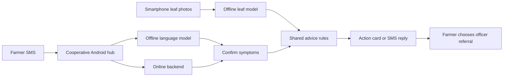

# Leaf Doctor

Leaf Doctor is our project for the **World Bank agriculture challenge** in **Small AI for Development** at Hack-Nation's 7th Global AI Hackathon, October 3–4, 2026. It is a coffee farm health tool for smallholder farmers with limited mobile data and infrequent access to an extension officer. It takes a farmer from trustworthy planting material to disease detection to a concrete next action, and it works on a basic phone as well as a smartphone.

This is a research prototype. Dataset accuracy does not establish field accuracy, physical-phone performance remains unverified, and we have not measured a yield benefit. The project is a hackathon submission, and it does not claim a World Bank partnership or endorsement.

## Contents

1. [The project in four steps](#the-project-in-four-steps)
2. [Step 1: Buy and audit planting material](#step-1-buy-and-audit-planting-material)
3. [Step 2: Classify coffee plant images](#step-2-classify-coffee-plant-images)
4. [Step 3: Deliver actionable help and trusted inputs](#step-3-deliver-actionable-help-and-trusted-inputs)
5. [Step 4: Future work, map disease hotspots and trends](#step-4-future-work-map-disease-hotspots-and-trends)
6. [Pitch and demo materials](#pitch-and-demo-materials)
7. [The hackathon](#the-hackathon)
8. [Getting started](#getting-started)
9. [References and sources](#references-and-sources)

## The project in four steps

The project team is Kevin Wang, Jerry Yan and Connor Lee. The scenario is Noor, a smallholder coffee farmer with two hectares, limited connectivity and occasional access to her daughter's smartphone. The setting is fictional, so we use Kenya's coffee belt for evidence. The app therefore works offline for photo capture and local classification, with saved advice and queued verification or service requests when a connection returns.

The execution sequence is: buy and audit seeds or seedlings, then classify coffee plant images, then immediately deliver a clear next action. Step 4 is future work beyond the hackathon: accumulate smartphone observations across space and time, then visualize hotspots and analyze disease patterns. Coffee is the first crop. Another crop needs crop-specific training data, evaluation and guidance.

| Step | What it does | Where it lives in the repo | Status |
|---|---|---|---|
| 1. Buy and audit planting material | Helps the farmer check that seed is genuine and traceable before planting | `shared/src/seedCheck.ts`, `mobile/src/screens/SeedCheckScreen.tsx`, the SMS paths in `backend/`, `bridge/` and `hub/` | The KEPHIS 1393 seed packet check is built. |
| 2. Classify coffee plant images | Offline photo classification with image-quality checks, an uncertainty route and a six-leaf vote | `mobile/`, `training/`, `shared/src/plantVote.ts` | Built. A research prototype that is not yet validated on a phone. |
| 3. Deliver actionable help and trusted inputs | Action card, verified contacts, referral to an extension officer, SMS and voice channels in Swahili and English | `shared/`, `backend/`, `hub/`, `bridge/`, `mobile/src/screens/` | Built, with some setup left (see the status tables) |
| 4. Map disease hotspots and trends | Color-coded map, timeline and review priorities from accumulated phone observations | `satellite-hotspots/` (separate component), observation storage in `mobile/src/storage/` | Future work. Only a synthetic preview and an overhead-imagery prototype exist. |

### What we are building

We are building for smallholder coffee farmers who have limited mobile data and infrequent access to an extension officer. The challenge uses a fictional farmer, Noor, and our research focuses on Kenya's coffee belt. Leaf Doctor combines offline leaf checks with SMS support so a farmer can decide what to inspect next and when to ask a person for help.

- **Offline leaf checks:** photograph up to six leaves on a smartphone. A bundled TensorFlow Lite model screens image quality and suggests a supported condition. Unclear photos prompt a retake, and conflicting or insufficient usable readings lead to an officer referral.
- **Action cards:** shared rules turn findings into next steps and a recheck date. Farmers can read the card aloud and choose to send a case summary through their SMS app.
- **Basic-phone support:** a cooperative's Android hub receives SMS questions. It uses the backend when connected and a local language model with rule-based replies when offline. Model-assisted symptom readings require confirmation.
- **English and Swahili:** the apps and replies support both languages. Unreviewed action-card translations fall back to English, and native-speaker review remains necessary before field use.

### What the project is for

Because of this tool, Noor can find out what is wrong with a sick coffee leaf, and reach a verified person about it, within a day of seeing the spots. She would otherwise do this late or not at all. The evidence in `docs/refined-plan.md` gives three reasons:

- Kenya has about one extension officer per 1,380 farmers ([Kenya extension policy 2023](https://kilimo.go.ke/wp-content/uploads/2024/10/KENYA-AGRICULTURAL-SECTOR-EXTENSION-POLICY-2023.pdf), summary only).
- Phone-only advice in trials moved yields by 4% with a confidence interval of -3% to 10% ([GiveWell](https://www.givewell.org/international/technical/programs/precision-agriculture-for-development)), while in-person training raised Ugandan coffee yields 7% ([IFPRI](https://www.ifpri.org/blog/training-ugandan-coffee-farmers-on-agronomy-practices-more-than-pays-for-itself/)).
- A trained diagnosis app beat farmers and extension agents in the field for cassava ([Nuru, Frontiers 2020](https://www.frontiersin.org/journals/plant-science/articles/10.3389/fpls.2020.590889/full)).

We do not claim Leaf Doctor raises yield. None of these studies tested it. 53.7% of Kenyans own a phone (48.6% in rural areas) and 29.6 million feature phones are still on networks, which is why SMS is the main channel.

### How the pieces connect

```
 Noor's phone --SMS--> cooperative hub phone (Android, SIM) ---+
 Noor's phone --call-> ElevenLabs voice line                   |
 Noor's phone --SMS/MMS/iMessage--> bridge (Mac Messages)      |
                                                               v
              online:  hub --HTTP--> Convex backend --> Claude (disease list only)
              offline: hub --> Qwen3.5-2B (parse Swahili to fields)
                                  --> rule matcher --> confirm-first reply
                                                               |
 Daughter's smartphone app: 6 photos --> offline TFLite -------+
   classifier --> confident / possible / unclear               |
                                                               v
                       buildActionCard() in shared/  (pure rules)
                         |-- SMS reply to Noor
                         |-- app card with call button
                         `-- case summary --> extension officer
                              (+ NASA POWER daily rain)
```

The same flow at a glance:



### Folder map

| Folder | What it is |
|---|---|
| `mobile/` | The Expo / React Native app for the farmer's household: consent, six-leaf capture, action card, officer handoff, seed check, settings |
| `hub/` | An Android app for the cooperative's SIM phone. It answers farmers' SMS, online through the backend or offline with an on-device model and rule matcher |
| `backend/` | A Convex server: Twilio SMS webhook, Claude advisor, photo diagnosis over SMS and MMS, phone-number login with SMS verification, sessions and rate limits, privacy page |
| `bridge/` | Relays texts and photos arriving in the Mac Messages app (SMS, MMS, iMessage) to Leaf Doctor and sends replies back |
| `shared/` | The rules used by every channel: disease facts, symptom matcher, action card, contacts, seed check, case summary, SMS formatting, on-device language-model tasks |
| `training/` | Scripts, manifests and checkpoints for training and evaluating the leaf classifiers (EfficientNet B0 to B3) |
| `satellite-hotspots/` | An independent overhead-imagery prototype for the future hotspot map |
| `docs/` | Plans, evidence, data-flow and research notes, and app screenshots |
| `evals/` | Swahili translation (FLORES-200), Kikuyu routing and population analyses |
| `pitch/`, `assets/`, `reels/` | The pitch deck, brand and 3D stage assets, and the 60-second demo video |

### Guardrails that apply to every step

- **Confirm first.** The model never finalizes a diagnosis alone. Every model-assisted result asks Noor a confirming question first.
- **Pre-approved Swahili only.** In our test, model-written Swahili failed on both model sizes, so farmer-facing Swahili comes from a fixed text set. New Swahili strings are stored as unreviewed and English is shown until a native speaker signs off.
- **"Not sure" goes to a person.** Low-confidence or unclear results set `needsPerson` and offer a case summary for the extension officer.
- **No invented doses.** Advice quotes the product label rate only. Cheap non-chemical measures (inspect, prune, clean up, shade, nutrition) come before any chemical.
- **Consent.** The first SMS asks for consent before storing anything. The app has a consent screen for photos and location, with export and delete.
- **Bias.** The classifier was trained on a few datasets, so its errors may fall unevenly on varieties and light conditions we have not tested.

### Known limits of the whole project

- The classifier cannot see coffee berry disease, berry borer or wilt. It will call such a leaf unclear or, worse, wrongly confident. Every output therefore needs a recheck and a person route.
- Field accuracy is unknown until it is tested on phone photos from the intended conditions.
- Kikuyu is probably Noor's home language and is untested. Until a Kikuyu speaker writes 30 test messages, Kikuyu text is treated as unclear and routed to a person. Swahili wording also needs a native-speaker review.
- The hub phone belongs to the cooperative. If it is off or out of credit, Noor gets no answer.
- The 2B language model needs about 4 GB of RAM, and its speed on a real phone is unmeasured. A cheap 2 GB phone falls back to keyword rules.
- Weather and seed-code trials cited here were on maize, and the Uganda coffee trial found phone advice gave only more modest changes than training.
- The verified contact list must be rechecked by a person before submission.

### What we cut and why

| Cut | Reason |
|---|---|
| Seed purchase audit | The seed check via KEPHIS 1393 stays as one piece of advice. The Kenyan seed-code trial was on maize ([J-PAL](https://www.povertyactionlab.org/evaluation/consumer-information-reduce-counterfeit-agricultural-goods-kenya)), and we found no coffee pesticide verification codes |
| Farm map UI | Costs a weekend. The map is described as what happens next (Step 4) |
| Spray-timing forecast texts | The SMS weather result (+12%) was on maize and beans, not coffee ([TomorrowNow](https://tomorrownow.org/weather-intelligence-that-reaches-the-last-mile-12-yield-gains-for-kenyan-farmers/)) |
| Fertilizer bag scanning | Needs its own dataset and label photos, and is not a leaf decision |
| iSDAsoil lime advice | Lime evidence is on maize. KALRO soil labs get a referral instead |
| Price feature | The brief asks for one decision. A price lookup is a spreadsheet job |
| Phone 3D scanning | The evidence is four hazelnut trees ([Sensors 2025](https://pmc.ncbi.nlm.nih.gov/articles/PMC12473222/)) |
| Zero-shot VLM diagnosis | A zero-shot Gemini 2.5 Pro scored 42.42% on banana disease, against 92.21% for a fine-tuned model ([BananaVLM](https://arxiv.org/html/2609.25040)) |

## Step 1: Buy and audit planting material

Poor-quality planting material can undermine a season before disease monitoring begins. This step makes sure the farmer starts with traceable, appropriate planting material and a recorded quality check.

### Research basis

- Uganda's National Seed Strategy cites an estimated 30 to 40% of seed offered for sale as counterfeit or fake. This is a country-specific estimate and not proof that 40% of all seed bought by African farmers is fake.
- Barriga and Fiala's Uganda maize study found no evidence of serious adulteration in its samples, but found variable quality consistent with handling and storage problems. Together these findings support checking both authenticity and viability. They do not establish an Africa-wide fraud rate or yield-loss percentage.
- For coffee, the purchase may be certified seed or nursery seedlings rather than a retail packet. KALRO's coffee training material describes propagation from certified coffee seed and names its Coffee Research Institute at Ruiru as a certified-seed source in Kenya. The correct supplier, variety and certification process must be confirmed for the farmer's actual country and conditions.

### Purchase and verification workflow

1. Before purchase, ask an extension officer or recognized coffee research service which variety and planting material suit the farm.
2. Find a recognized seed dealer or nursery and verify its authorization with the relevant national authority.
3. Record the supplier's name, contact, location, licence or registration details, variety, batch or nursery lot, quantity and price.
4. For packaged seed, photograph the sealed package and label. Check the variety, lot number, certification details, stated germination information, packaging or test date and any use-by date. Reject damaged, opened or suspiciously relabelled packs. Ask about storage conditions and keep the receipt and packaging. KEPHIS recommends recognized dealers, intact original seals and traceable purchase records in Kenya. A missing expiry date alone is not proof of fraud.
5. For coffee seedlings, inspect plant condition and ask for nursery authorization, variety identity, propagation source and lot records. Confirm suitability with a coffee adviser.
6. A photograph can document visible condition and label inconsistencies, but it cannot prove genetic identity or germination performance. Where quality is uncertain, arrange a germination or laboratory check before committing to a large purchase.
7. Where an official verification service exists, use it rather than inventing an authenticity score. KEPHIS describes a Kenyan scratch-code SMS check using 1393. That is a Kenya-specific packaged-seed example. It does not automatically apply to coffee seedlings or other countries. A valid code supports traceability but does not guarantee good storage or viability.
8. Failed connectivity produces "verification pending", not "fake seed".

The completion criterion is a traceable supplier, appropriate planting material, a recorded quality check and a clear verified, pending or unresolved status. The prototype is meant to show both a successful audit and a suspicious or incomplete purchase routed to an adviser.

### What is built

| Piece | Where | What it does |
|---|---|---|
| Seed check rules | `shared/src/seedCheck.ts`, with tests in `seedCheck.test.ts` | Produces the three steps (find the KEPHIS sticker, scratch it, text the code to the short code), the result note and the coverage note. Swahili lines are stored as unreviewed drafts, so English is shown until a native speaker reviews them. |
| Verified contact | `shared/src/contacts.ts` | `kephis-seed-check` with short code 1393, verified on 2026-10-03 against the KEPHIS stakeholder page |
| App screen | `mobile/src/screens/SeedCheckScreen.tsx`, `mobile/src/components/SeedPacketSticker.tsx`, `mobile/src/screens/textSeedCode.ts` | A "Check a seed packet" screen that opens the phone's SMS app with the code addressed to 1393 |
| SMS paths | `backend/`, `bridge/`, `hub/` (through `shared/`) | A text of SEED, SEEDS, MBEGU or KEPHIS is answered with the KEPHIS 1393 instructions on every SMS path |
| Coverage note | in the check copy | States that the check works for certified packaged seed and that nursery seedlings usually have no sticker, so the farmer should ask the field officer |

Screenshots: [seed check screen](docs/screens/11-seed-check.png) and [seed check SMS](docs/screens/12-seed-check-sms.png).


## Step 2: Classify coffee plant images

The goal is a compact image classifier for the coffee diseases in the provided labelled images, with healthy examples included, running locally on the phone. The app has to handle unclear images and symptoms outside the supported classes through a retake or adviser-review route. Research on coffee leaf classification supports this approach (Esgario and colleagues), and broader plant-disease research (Mohanty, Hughes and Salathe, 2016) shows why laboratory-style image performance must be checked against real field conditions.

The completion criterion is that the supported coffee classes work on a held-out field test and on the target phone, with an explicit uncertainty route. The model in this repo meets the first part only on dataset splits. Field and phone validation are still to do.

### Farmer capture and feedback in the app

The farmer or her daughter photographs a symptomatic leaf or plant. The app checks whether the image is usable, runs classification locally and presents a plain-language suspected result, model confidence and a simple next step. Low-confidence or unsupported results ask for a clearer photograph or human review. Confidence is not presented as a probability that the entire farm has the disease. Diagnosis stays provisional when symptoms need further examination or testing.

| What happens | Where |
|---|---|
| Consent screen for photos and location, with export and delete | `mobile/src/screens/ConsentScreen.tsx`, `mobile/src/storage/dataControls.ts` |
| Six-leaf capture. Each leaf slot is a separate photo | `mobile/src/screens/CaptureScreen.tsx`, `mobile/src/components/LeafSlots.tsx`, `useCaptureFlow.ts` |
| Image quality checks and retake prompts (brightness and blur) | `mobile/src/diagnosis/imageQuality.ts`, `qualityGuidance.ts` |
| On-device classification | `mobile/src/diagnosis/classifyLeaf.ts`, `useLeafModel.ts`, `modelDecision.ts` |
| A vote across the leaves into one plant verdict. Disagreement or low confidence becomes "not sure" | `shared/src/plantVote.ts`, `mobile/src/diagnosis/diagnosePlant.ts` |
| Choice of model: B0 (default), B1 or B2 | `mobile/src/components/ModelSelector.tsx`, `mobile/src/diagnosis/modelCatalog.ts` |
| Saved record per observation: capture time, GPS with its accuracy, farm section and model version | `mobile/src/storage/observations.ts`, `deviceLocation.ts`, `mobile/src/screens/FarmSectionPicker.tsx` |

Screenshots of this flow: [consent](docs/screens/00-consent.png), [empty capture](docs/screens/01-capture-empty.png), [three leaves agree](docs/screens/03-three-leaves-agree.png), [leaves disagree](docs/screens/06-leaves-disagree.png) and [retake prompts for unclear photos](docs/screens/09-retake-prompts-unclear.png). The demonstration is meant to include a usable image, an unclear image and an uncertain result that correctly reaches a human adviser.

### Evidence it works, and what is still to measure

Already measured: on 24 synthetic Swahili and English messages with the confirm-first policy, the on-device language model (Qwen3.5-2B) filled 84 of 94 fields correctly and produced 0 wrong final diagnoses. The 0.8B model filled 77 of 94 and was rejected, because garbled Swahili passed its safety check and its translations hurt the matcher. That model belongs to the SMS channel in Step 3. For the image classifier, the measured results are in the model report below.

To measure and report as found, even if the number is worse than hoped:

- Test splits that keep every farm or session in only one set, so photos of the same plant never sit in both training and test, with per-class precision and recall and the pairs the model confuses.
- Classifier size and speed on a real cheap Android phone.
- The share of unusable photos caught, and the share of uncertain results routed to a person.
- Six-leaf voting against single-leaf scoring. Nuru reported 74 to 88% with six leaves ([PMC7775399](https://www.ncbi.nlm.nih.gov/pmc/articles/PMC7775399/)).

### Data

| Dataset | Source | Licence | Size | Use |
|---|---|---|---|---|
| Project-AgML arabica coffee leaves | [Project-AgML](https://github.com/project-agml) | CC-BY-4.0 | 58,549 images, 5 classes (rust, cercospora, leaf miner, phoma, healthy) in the original plan | Train the classifier |
| BRACOL arabica leaves | Brief's Annex B list | Terms to be checked before use | Expert-reviewed annotations | Field test set and added training crops |
| Synthetic Swahili and English messages | We wrote them | Ours | 24 messages | Local language-model evaluation |

Not covered: coffee berry disease, coffee berry borer and coffee wilt are not classes in the training set. The images come from a few datasets and not from Noor's slope, and the Swahili test messages are synthetic. The model report below gives the final training sources and counts.

The detailed model report follows. It was written by the model team and is kept as written, with its headings moved down one level.

### Local coffee-leaf model

See the [model data card](docs/data-card.md) and the [committed recovered evaluation](training/results/final-evaluation.json). That evaluation is marked `not_reproduced`; the historical metrics below are tied to the current artifact and calibration hashes.

The desktop training pipeline starts from `Huyt/arabica-coffee-leaf-disease-efficientnet-b0` at revision `252d26841543befab22880876f8ca91543230aab`. It uses PyTorch/timm on CPU and exports a bundled offline TensorFlow Lite model. The existing `training/train.py` is the separate original MobileNet experiment; use the EfficientNet scripts below for this model.

The current bundled model version is `deployed-v1` with **4,017,796 parameters**. `mobile/assets/model/coffee-leaf.tflite` is **8,091,596 bytes (7.72 MiB)**, with FP16 weight storage and float32 operations/input/output. Its SHA256 is `19b4f9747604dcff2cc43f44e3056f5c4fd827e3b0556e6632e1acbd1ce6ccda`. Desktop CPU inference measured a median of about **51 ms** with four threads; this is not a phone benchmark. The fresh-process verifier blocked outgoing sockets and observed zero attempts. Android/iOS device validation has not been performed.

#### Data and training

`training/sources.json` records sources, pinned revisions, licenses, inclusion/exclusion decisions and source/class/split counts. Five training families are used: AGML Arabica, BRACOL, RoCoLe, CoffeeLeaf-CO (including its Silva derivative subset), and Makerere Beans as unsupported non-coffee examples. The preparation retains **23,552 distinct examples**, including evaluation-only material: 14,119 train, 3,921 validation, 4,571 test and 941 external. All training examples contribute to the classifier stage. The last-backbone stage rotates one crop per parent and label each epoch to reduce correlated crop dominance. This is 30 classifier epochs followed by three partial-backbone epochs; validation selected epoch two. A further 35-epoch source-balanced/distilled classifier candidate scored lower on mean per-source validation macro F1 (0.8104 versus 0.8648) and was not selected.

Exact hashes, perceptual hashes, parent images and available plant IDs form 6,174 groups. No group crosses partitions. AGML was used by the original pretrained model; those tests must not be described as entirely unseen. CoffeeLeaf empty annotations are not treated as healthy. Dataset crop counts are not counts of independent plants. The 1,120-image RGB rust collection is a previously inspected development stress test, not training data. Its NoRust class is a binary negative, not a healthy diagnosis. The separate 100-image PG26038 set contains flatbed scans of 50 paired leaves; Mycena citricolor is unsupported, not cercospora. Both external collections were audited for exact and near matches to train/validation and known pretraining-exposed groups, with no matches found.

AGML provenance includes field-origin digital-camera images from one plantation in Mutira, Kirinyaga County, Kenya. Those images are pretraining-exposed source material, not prospective Kenyan-farm validation; independent smartphone validation remains outstanding.

#### Results and limits

The recovered historical report for the deployed FP16 runtime, before the brightness-v1 update below, scored **91.05% raw accuracy** across the 4,571 internal test images. Its frozen per-class confidence and image-quality rules accepted **81.49%**; **93.10%** of accepted predictions were correct. On sources new to fine-tuning, raw accuracy was **89.53%**, accepted coverage was **74.25%**, and accepted accuracy was **91.57%**; cercospora precision was **50.00%**. All 128 held-out bean images were rejected. These are dataset results, not established field accuracy.

External results remain poor: the rust development collection scored **AUROC 0.491**, rust recall **52.66%** and specificity **43.59%** at its own validation-selected binary threshold. The original model's AUROC was 0.420. All 100 untouched external scans were rejected; raw supported-class accuracy was 20%. Synthetic severe blur was rejected only 28.7% of the time, although severe darkness was always rejected in the 223-image quality check. This model is a research prototype and needs representative phone-camera validation before field reliance.

Output order is `cercospora, healthy, miner, phoma, rust, red_spider_mite, weevil_damage, unsupported`. Mite predictions are disabled because validation evidence was insufficient; the unsupported class is always rejected. Weevil means possible chewing damage, not confirmed insect identification. Scores are model scores, not probabilities of a confirmed diagnosis. The JSON beside the model supplies the final thresholds. They were chosen on deployed-runtime validation predictions, never on the final photo sample.

With a local photo, the committed artifact-only check is:

```sh
training/.venv/bin/python training/verify_offline.py --artifact-only --photo /path/to/photo.jpg
```

It checks the artifact and config hashes, the input/output signature, normalized softmax, internal operations, FP16 storage, quality gate, and blocked network calls. It does not require a training checkpoint.

Across all 4,571 test images, FP16 and Python differed on seven top labels, nine accept/reject decisions and 15 confidence states. Maximum score difference was 0.0303. The deployed runtime determines app decisions. Before inference, resize the shortest side to 256 and center-crop 224; supply float32 RGB in 0..255 with shape `[1,224,224,3]`. Normalization and calibrated softmax are inside the graph. Desktop evaluation uses bicubic resize; native phone interpolation and JPEG encoding still require device-level verification.

#### Brightness feedback

The app now uses `mobile/assets/model/brightness-config.json` for exposure screening, while retaining the model weights, JPEG inference pixels, blur threshold and disease-confidence thresholds. `training/calibrate_brightness.py` derives brightness bounds from all **13,085 supported training images**, weighting sources, groups, parents and their crops equally at each level. It verifies every image hash and freezes the limits before validation. It does not use the external scans to choose thresholds.

Brightness is measured on a lossless PNG of the same 224-pixel crop, weighted by alpha so transparent backgrounds contribute nothing. Opaque photographs still include their background; this change does not locate the leaf. Mean luminance below **40.3341** prompts the user to increase light. Mean luminance above **199.9971**, together with more than **9.2554%** of pixels at grayscale 250 or higher, prompts the user to reduce harsh light or flash. Both messages appear in English and Swahili with a retake button. Brightness guidance takes precedence over blur guidance, and unclear results continue hiding disease advice.

After freezing the limits, **3,776 of 3,788** normal supported validation images passed the brightness check. All 3,788 synthetic images darkened to 10% were flagged; 3,195 of 3,788 brightened 4× were flagged. The 100 transparent scans pass the corrected brightness check, but their poor disease predictions remain unresolved. These are exposure-screening results, not updated end-to-end accuracy or phone-validation results. Earlier acceptance/precision numbers above describe the original gate and must not be attributed to this update.

Run `training/.venv/Scripts/python.exe training/calibrate_brightness.py` to reproduce the limits and evidence in `training/runs/brightness_v1/`. Run `node --experimental-transform-types training/check_mobile_contract.cjs` for class-gate, exposure, transparency, decoder, localization and mocked classifier integration checks. Native resize/color handling and the extra PNG encoding still require a physical-phone check.

#### Reproduce on Windows

Python 3.12 is used. Install CPU PyTorch from its official index, then the locked environment:

```powershell
python -m venv training/.venv
training/.venv/Scripts/python.exe -m pip install torch==2.14.1+cpu torchvision==0.29.1+cpu --index-url https://download.pytorch.org/whl/cpu
training/.venv/Scripts/python.exe -m pip install -r training/requirements-efficientnet-lock.txt
training/.venv/Scripts/python.exe training/download_sources.py
training/.venv/Scripts/python.exe training/download_extra.py
training/.venv/Scripts/python.exe training/download_co.py
training/.venv/Scripts/python.exe training/download_field.py
training/.venv/Scripts/python.exe training/download_scans.py
training/.venv/Scripts/python.exe training/prepare_data.py
training/.venv/Scripts/python.exe training/finetune.py --epochs 3
training/.venv/Scripts/python.exe training/calibrate_rejection.py
training/.venv/Scripts/python.exe training/export_mobile.py --publish
training/.venv/Scripts/python.exe training/final_evaluation.py
training/.venv/Scripts/python.exe training/verify_offline.py
```

Keep seed 42, the pinned downloads and `data/manifest.json` with the run. Feature caches validate the manifest, actual image contents, preprocessing and model state. Training and candidate selection must happen before calibration/export; repeat those downstream stages whenever selecting a new checkpoint. `training/improve_generalization.py` reproduces the optional source-balanced comparison. Hardware/library changes can alter numerical results.

For a single local photo, run `training/.venv/Scripts/python.exe training/infer.py C:/path/to/leaf.jpg`. The selected checkpoint, histories and full frozen-gate evaluation live under `training/runs/efficientnet/`. `training/evaluate_photos.py --output C:/path/to/evaluation` produces a reproducible 20-image internal photo review plus separate external examples after training; it asserts that model and app artifacts stay unchanged. Large data, environments, caches and research checkpoints are ignored by Git. The deployable model remains at the application's existing tracked asset path.

#### Additional data and scale experiments

The validated model and its app integration were pushed in commit `aa836a0fffdc9c58065d557923211a6d2ecbf865` after syncing the latest repository. The merged code passed 39 tests, root/mobile lint and type checks, and the mobile model contract checks. Mobile lint retains the existing bundled-asset `require()` warning. There were no unresolved merges or case/Unicode filename collisions.

The subsequent local experiments considered 29 registered sources. They admitted 1,498 Peru photos (one corrupt image excluded) and 7,364 crops from expert-reviewed BRACOL annotations. BRACOL crops are additional annotations of existing photographs, not new independent plants; all inherit their original parent groups and splits. The resulting candidate manifest has 20,311 training, 5,294 validation, 5,868 test and 941 external rows. Sampling rotates grouped examples rather than using every correlated crop in each epoch. Empty annotations are never relabelled healthy. The entire augmented Uganda source was excluded after transformed overlap was found; Xinzhai remains unused pending taxonomy and overlap checks, and its downloaded archive contains no mite class. Source details are in `training/sources.json`.

`training/train_scale.py` ran six conservative epochs with scale/context augmentation. `training/train_scale_balanced.py` then restarted from the published incumbent, ran four epochs at learning rate 0.000003, used 70% original-view replay and 30% full-target padded scale views, and sampled more distinct weak-class examples. Both froze BatchNorm statistics and most backbone weights, used weight decay, dropout, label smoothing, and validation-based selection with patience two. Correct, confident teacher outputs were a regularizer only; no source labels were replaced by model predictions. Context enlargement is confined to the padded branch in the follow-up, avoiding the center-crop loss found by the annotation coverage audit. Original canonical app crops may still trim elongated targets.

Neither run passed the replacement criteria. The follow-up's final mean per-source validation F1 on the smaller-leaf probe rose from 0.5212 to 0.6582, but original-view Cercospora F1 fell from 0.8683 to 0.8323 and mite F1 from 0.4308 to 0.4068. Healthy F1 rose from 0.8618 to 0.8929. The published app model and calibration therefore remain unchanged. These are validation results, not new test or field-accuracy claims; no test predictions were used for candidate selection. Training has stopped at the planned limits. Distance variability is not solved by these experiments.

Local histories and audits are under `training/runs/scale_v2/` and `training/runs/scale_v3/`. `training/audit_context_coverage.py` traces all context views to their original annotation index, category, box and preprocessing coverage. `training/prepare_expert_data.py` creates the reviewed-crop manifest without changing earlier splits. `training/report_scale_experiments.py --output C:/path/to/report` exports the comparison and source/label audits.

#### Choosing between EfficientNet-B0 and EfficientNet-B1

The capture screen offers B0 (the original model), B1 (experimental) and B2 (the default). Only the selected model is loaded, selection is disabled while a photo is being processed, and results identify the model used. Loading failures offer retry or switching models. Both use the same brightness feedback and input crop, with separate validation-calibrated disease-confidence thresholds. Both assets are bundled for offline use.

B1 starts from Apache-2.0 ImageNet weights `timm/efficientnet_b1.ft_in1k` at revision `1d6ddfd0ad535646fdb05bc3834913d93816152e`. It has 6,523,432 parameters and uses 224-pixel input, consistent with that checkpoint's training resolution and the existing app contract. Its classifier sees all **20,311 vetted training images**, including Peru and reviewed BRACOL crops. The same 5,294 validation images guide selection. Evaluation-only sources and unresolved datasets remain excluded. This compares the delivered models: B0 has coffee-specific pretraining and the original corpus, while B1 has ImageNet pretraining and the expanded corpus. The results cannot isolate the effect of architecture alone.

B1 uses seed 20261003. Its regularized classifier stage stopped after 21 epochs and retained epoch 16; the partial-backbone stage completed its six-epoch maximum and selected epoch six. Most weights and BatchNorm statistics stay frozen. Grouped parent rotation, mild color jitter, full-target padding, dropout, weight decay and label smoothing limit overfitting. Selection combines ordinary, smaller-leaf and full-context validation scores; Cercospora, healthy and mite F1 may not fall more than one percentage point below B1's classifier-stage baseline. Held-out and external images never select checkpoints or thresholds. These controls reduce overfitting risk but cannot establish real-world generalization. All 25,605 current train/validation image hashes matched the manifest, and fresh predictions on 96 class-balanced validation images exactly matched the saved selected-checkpoint logits.

After preparing the existing `scale_v3_manifest.json`, reproduce the B1 workflow with the locked Python environment:

```powershell
training/.venv/Scripts/python.exe training/b1_train.py
training/.venv/Scripts/python.exe training/b1_verify.py
training/.venv/Scripts/python.exe training/export_b1.py
training/.venv/Scripts/python.exe training/verify_b1_offline.py
training/.venv/Scripts/python.exe training/compare_models.py --output-dir C:/path/to/comparison
```

Training overwrites the B1 research run; archive any research results you need before rerunning it. Export publishes only `coffee-leaf-b1.tflite` and `model-config-b1.json`. B0's model and calibration stay unchanged. The B1 export uses per-channel INT8 convolution-weight storage with float32 computation; this is a size optimization, not a claim of integer inference or faster execution. Full validation must retain accuracy and macro F1 within one percentage point of the chosen checkpoint before publication. The comparison evaluates both actual app exports on identical test images, checks checkpoint/runtime parity, applies the shared current brightness rules, and measures fresh desktop CPU latency. Physical-phone performance, native preprocessing and field accuracy still require device validation.

##### Completed B0/B1 comparison

The frozen app exports were evaluated on the same 5,868 test images. The table uses the current shared brightness policy and each model's own frozen validation confidence thresholds. The original 4,571-image subset is also retained for continuity with the earlier report.

| Metric | B0 | B1 |
| --- | ---: | ---: |
| Original test accuracy (4,571 images) | 91.05% | 93.96% |
| Expanded test accuracy (5,868 images) | 86.79% | 93.27% |
| Expanded test macro F1 | 0.7614 | 0.8640 |
| Accuracy among accepted expanded-test predictions | 88.09% | 94.16% |
| Expanded-test acceptance coverage | 80.11% | 79.38% |
| Unsupported expanded-test images falsely accepted | 38 / 202 | 0 / 202 |
| Synthetic smaller-leaf macro F1 (1,495 images) | 0.5682 | 0.7721 |
| External rust AUROC (1,119 images) | 0.4917 | 0.7421 |
| External rust recall at frozen binary cutoff | 52.66% | 15.82% |
| External rust specificity at frozen binary cutoff | 43.75% | 99.63% |
| Supported external scan accuracy (60 images) | 20.00% | 31.67% |
| Accuracy among accepted scans | 9 / 55 (16.36%) | 19 / 55 (34.55%) |
| Bundled model size (decimal MB) | 8.09 | 7.32 |
| Fresh matched desktop CPU median | 87.1 ms | 121.2 ms |

B1 is the stronger overall research candidate. Its expanded-test accuracy gain is 6.48 percentage points, with a paired recorded-group bootstrap 95% interval of +4.27 to +8.95 points. The gain on the original test is 2.91 points (+1.56 to +4.30). Groups are parent/capture proxies, not guaranteed independent plants. All eight classes improved on the expanded test, including Cercospora F1 from 0.6773 to 0.7867, healthy from 0.7329 to 0.9547, and mites from 0.3191 to 0.4828. B0 retains an advantage on original-test Phoma F1 (0.8947 versus 0.8392). Mite diagnoses remain disabled in both apps because neither passes the validation precision/evidence requirement.

External imaging is still unreliable. B1 ranks external rust better, but its validation-selected binary cutoff of 0.16 detects only 134 of 847 rust images. The actual multiclass app accepts just 22 of those 847 images as rust; AUROC is not diagnosis accuracy. Its 55 accepted scans contain only 19 correct diagnoses and 13 unsupported false accepts. Neither model is ready for field reliance. These previously inspected external collections were not used to select checkpoints, compression or thresholds. The expanded-source overlap audit conservatively removes one possible rust near-match, leaving 1,119 images; the original 100 scans remain. Synthetic smaller-leaf improvements do not establish accuracy on genuine distant phone photographs.

The B1 app asset is 7,324,120 bytes with SHA256 `28c5d1cf1ac3f268d66f9c9f50f35e0a4602dced07f55e07b17f4c6cdae18c75`. Its uncompressed conversion matched the checkpoint on 64 class-balanced validation images with no top-label changes and maximum probability error 0.00000668. Compression changed 30 of 5,294 validation top labels, with +0.094 percentage points accuracy and -0.021 points macro F1. Across all 5,868 held-out images, B1 checkpoint/app outputs differ on 45 top labels, 37 acceptance decisions and 77 confidence states; maximum probability difference is 0.2485. The table therefore uses the actual app export, not checkpoint results. B0 parity on the same expanded test is 10 top-label, 11 acceptance and 21 confidence-state differences.

Both model identities, configurations and the brightness policy stayed unchanged throughout evaluation. Fresh-process B1 inference passed with Python outbound socket calls blocked and zero attempted connections; this is not an operating-system firewall or physical-phone test. The fresh latency benchmark alternates the models over the same 64 images for 128 timed invocations each with four CPU threads, excludes image decoding/preprocessing, and runs after training and other inference jobs finish. Full evidence, class/source breakdowns, confusion matrices, manifest audits and paired intervals are in `training/runs/model_comparison/comparison.json`. App TypeScript, lint, six model-selection tests, the 39-test shared/backend suite, brightness contracts and the Android JavaScript/asset export passed. The Android export contains both model files; no native phone build was tested.

#### EfficientNet-B2 experiment

B2 follows the B1 training functions in an isolated module namespace. It uses the same 20,311 training images, 5,294 validation images, seed 20261003, grouped sampling, augmentation, optimizer settings, stopping limits and validation selection safeguards. Neither existing model is retrained or replaced. The third app choice has its own model and confidence configuration, uses the shared brightness feedback, and is the default selection.

The initialization is the Apache-2.0 `timm/efficientnet_b2.ra_in1k` checkpoint at revision `3577c4a7d84723645311bb5a9e5086f1b62ec8e2`, with weights SHA256 `e9adbcce7e5d5055c571c4cafdcc7f920b6a6ec42e643c49dff1aabe1d5f53c5`. The eight-class model has **7,712,266 parameters**. Its native pretraining resolution is 256 pixels and its published test setting is 288 pixels. This experiment fine-tunes and evaluates it at the common **224-pixel app resolution**. B1 and B2 therefore share the fine-tuning recipe and data, while their pretrained initialization and pretraining recipes differ. This comparison does not measure B2 at its published 288-pixel setting or isolate architecture alone.

Use the existing locked Python environment and prepared `scale_v3_manifest.json`:

```powershell
training/.venv/Scripts/python.exe training/b2_train.py
training/.venv/Scripts/python.exe training/b2_verify.py
training/.venv/Scripts/python.exe training/export_b2.py
training/.venv/Scripts/python.exe training/verify_b2_offline.py
training/.venv/Scripts/python.exe training/compare_models_b2.py --output-dir C:/path/to/comparison-b2
```

The B2 run identity checks the training engine, wrapper, dataset code, pinned initial weights, manifest, seed and input size before resuming. Export uses the same validation-only compression limits and calibration policy as B1, writes only `coffee-leaf-b2.tflite` and `model-config-b2.json`, and verifies incumbent identities. Reports are stored separately under `training/runs/efficientnet_b2/` and `training/runs/model_comparison_b2/`. The three-model evaluation reuses B0/B1 predictions only when strict cache signatures still match; it preserves their previous reports and measures new CPU timings with all six model orders balanced. No test or external image selects the B2 checkpoint, export variant or confidence thresholds.

B2 training completed with classifier epoch 21 selected after early stopping at 26 epochs, followed by the selected backbone epoch 6 at the six-epoch limit. The checkpoint's selection-set validation accuracy is 93.33% and macro F1 is 0.8660; these are not held-out test results. All 25,605 training/validation image hashes matched the manifest, and fresh logits on 96 validation images exactly matched the selected checkpoint's saved predictions. The checkpoint SHA256 is `eb6a5d4daac75046befce1250bc9278d4c1d2ccfa8ccf0fe2f4302cb918e8dd8`.

The B2 app asset is 8,573,416 bytes with SHA256 `ddbea87650b839dabb376f32d7e210ccc21a105024de23b3c0abf25fbbe86a01`. Uncompressed conversion matched the checkpoint on 64 validation samples with no top-label changes and maximum probability error 0.00000244. The selected INT8 weight-storage export changed 50 of 5,294 validation top labels, reducing accuracy by 0.264 percentage points and macro F1 by 0.223 points, within the unchanged one-point limits. Maximum per-probability error was 0.5101, so later comparisons must evaluate the actual exported model rather than substitute checkpoint scores. Confidence thresholds were fitted using that export's validation predictions; mite diagnoses remain disabled because the precision/evidence requirement was not met. Fresh-process inference passed with Python outbound socket calls blocked and zero attempted connections. Physical-phone behavior remains untested.

The app now offers B0, B1 and B2, with B2 selected by default. TypeScript, full mobile lint, all six model-selection tests, the brightness/model contracts and the Android JavaScript/asset bundle passed. The bundle contains all three model assets; it is not a physical-device build or test.

The final held-out evaluation now includes B0, B1, B2 and the separately verified B3 candidate. B3 remains outside the app because its exported file exceeds the unchanged 10 MB limit.

The separate four-model runner requires a completed, verified B3 directory and preserves earlier reports:

```powershell
training/.venv/Scripts/python.exe training/compare_models_b3.py --b3-dir training/candidates/efficientnet-b3 --check-ready
training/.venv/Scripts/python.exe training/compare_models_b3.py --b3-dir training/candidates/efficientnet-b3 --output-dir C:/path/to/model-comparison-all-four
```

It uses the same matched test partitions and external collections, evaluates actual exported models, reports every pair's recorded-group accuracy interval, and measures fresh CPU timings with model order balanced. An exported B3 candidate over the unchanged 10 MB app limit can be compared, but its deployment ineligibility is reported explicitly; comparison does not install it in the app.

The pairwise 95% bootstrap intervals are descriptive and unadjusted across six pairs and multiple subsets. They cover accuracy differences, not macro F1, AUROC or acceptance metrics. The expanded test's 5,868 images represent 982 recorded capture/parent groups; these proxies do not measure uncertainty across new farms, new imaging conditions or training seeds. Mites have only 26 test images in 18 groups from one source, and the 894 weevil crops represent 63 groups from one source. Per-class and source-specific results matter alongside overall accuracy. External collections have been inspected previously and remain stress tests, not fresh confirmatory field validation.

##### Completed four-model comparison

All four frozen exports were evaluated on the same images with the same current brightness/blur policy and their own validation-selected confidence thresholds. B3's gate results simulate the app policy offline; they do not imply installation. The full report, confusion matrices, per-source/class results, checkpoint/export parity and all six pairwise intervals are in `training/reports/model_comparison_b3/comparison.json`.

| Metric | B0 | B1 | B2 | B3 candidate |
| --- | ---: | ---: | ---: | ---: |
| Expanded test accuracy (5,868 images) | 86.79% | 93.27% | 94.09% | 93.22% |
| Original test accuracy (4,571 images) | 91.05% | 93.96% | 94.47% | 93.74% |
| Expanded macro F1 | 0.7614 | 0.8640 | 0.8720 | 0.8544 |
| Accuracy among accepted test predictions | 88.09% | 94.16% | 95.14% | 94.14% |
| Test acceptance coverage | 80.11% | 79.38% | 79.52% | 79.11% |
| Unsupported test images falsely accepted | 38 / 202 | 0 / 202 | 0 / 202 | 0 / 202 |
| Synthetic smaller-leaf macro F1 (1,495 images) | 0.5682 | 0.7721 | 0.8440 | 0.8083 |
| External rust AUROC (1,119 images) | 0.4917 | 0.7421 | 0.7780 | 0.6973 |
| External rust recall at frozen binary cutoff | 52.66% | 15.82% | 4.72% | 23.26% |
| External rust specificity at frozen binary cutoff | 43.75% | 99.63% | 100.00% | 98.90% |
| Correct accepted rust diagnoses on 847 external positives | 143 | 22 | 16 | 52 |
| Falsely accepted rust diagnoses on 272 binary negatives | 74 | 0 | 0 | 0 |
| Correct predictions among accepted external scans | 9 / 55 | 19 / 55 | 10 / 89 | 28 / 63 |
| Unsupported external scans falsely accepted | 16 / 40 | 13 / 40 | 34 / 40 | 13 / 40 |
| Supported external scan raw accuracy (60 images) | 20.00% | 31.67% | 18.33% | 56.67% |
| Export size (decimal MB) | 8.09 | 7.32 | 8.57 | 11.80 |
| Parameters (millions) | 4.02 | 6.52 | 7.71 | 10.71 |

B2 has the highest measured aggregate test accuracy, macro F1 and synthetic smaller-leaf macro F1. Its accuracy advantage over B1 is 0.82 percentage points, but the descriptive paired 95% interval is -0.02 to +1.64 points, so this run does not establish a clear accuracy separation. B2 improves Phoma F1 from B1's 0.8319 to 0.8906 and mites from 0.4828 to 0.5397, while Cercospora falls from 0.7867 to 0.7167. B3's accuracy is effectively tied with B1 on this test (-0.05 points; interval -0.87 to +0.80), and its macro F1 is lower. B3 trails B2 by 0.87 points (interval -1.69 to -0.11). These intervals are unadjusted and do not identify a universal winner across classes, sources and deployment conditions. Mite diagnoses remain disabled in every model's confidence policy.

External imaging remains inadequate for field reliance. B2's higher rust AUROC does not translate into useful recall at its frozen threshold, and its 89 accepted scans contain only 10 correct predictions and 34 unsupported false accepts. B3 performs best on these scans, but only 28 of its 63 accepted predictions are correct, and it correctly accepts just 52 of 847 external rust positives under the app policy. B1 retains advantages over B2 on Cercospora, several source-specific results and scan rejection. B2 is useful for continued internal/scale experiments; B3's measured tradeoffs and size failure do not support replacing an app model. None of these results resolves the external-imaging requirement.

B3 has 10,708,528 parameters; its 11,796,544-byte export SHA256 is `5ab0a8f6292b67440d4c53e51b6b8155a5c474c403428f7a70974d599997deb4`. Its selected checkpoint SHA256 is `a808dffa181630d47acc74788dcf38f95d0618b1e51b0dcd7f0990071d55c433`. It uses the same fine-tuning data and rules but a different ImageNet initialization, with native 288/320-pixel training/test settings reduced to the shared 224-pixel experiment. The historical B2 wrapper change detected by B3's broad file guard is preserved in the report: only the exact independently reconstructed completed-run guard/history additions are allowed; training, preprocessing and selection engines remained unchanged. Frozen artifacts and prior reports were verified unchanged throughout both evaluation and timing.

##### Repeated single-image response times

These are fresh measurements after all training and parallel evaluation workers exited. The main comparison measured 256 loaded-model invocations per model over the same 64 images, balancing four model orders. A separate response test used eight fixed images (one per class), 12 repeats per image, or **96 timed single-image responses per model**. Its inference and total-response columns below come from the same trials. All measurements use four CPU threads on this desktop.

| Timing metric | B0 | B1 | B2 | B3 candidate |
| --- | ---: | ---: | ---: | ---: |
| Main comparison mean invocation (256 trials) | 56.8 ms | 83.9 ms | 90.6 ms | 117.4 ms |
| Single-image mean inference (96 trials) | 57.6 ms | 86.1 ms | 92.9 ms | 120.1 ms |
| Single-image mean response including preparation | 62.7 ms | 91.3 ms | 98.1 ms | 125.2 ms |
| Single-image median response | 59.8 ms | 89.2 ms | 95.1 ms | 122.9 ms |
| Single-image 90th-percentile response | 72.9 ms | 104.6 ms | 110.1 ms | 140.5 ms |

Total response includes fresh local image opening/decoding, resizing/cropping, the shared quality checks (including a second image decode for exposure), tensor transfer, model invocation, output retrieval and the confidence/quality decision. It excludes model loading, initialization, camera capture, mobile bridge work and UI rendering. Models and the operating-system file cache were warm. The eight inputs are dataset crops ranging from 37×32 to 910×272 pixels; the results do not establish full-resolution phone-photo or native Expo response time. Per-image dimensions, all raw trials, means, medians, tails, source identities and checks are saved in `training/reports/model_comparison_b3/single_image_timing.json`.

```powershell
training/.venv/Scripts/python.exe training/benchmark_single_image.py --b3-dir training/candidates/efficientnet-b3 --output-dir C:/path/to/model-comparison-all-four
```

Run this only after the four-model comparison completes and other CPU workloads finish. The timing script requires the matching completed report and verifies frozen inputs and source code before and after measurement.


##### Packaged models and evaluation evidence

B0, B1 and B2 exports and configurations are in `mobile/assets/model/`. The B3 export, selected checkpoint, configuration, original training scripts and verification evidence are in `training/candidates/efficientnet-b3/`. B3 remains an offline comparison candidate above the 10 MB per-model app limit. The app selects B2 by default and allows B0/B1 selection in the multi-leaf workflow; switching clears the current check, and saved checks record the selected calibration/artifact version.

The selected B0/B1/B2 checkpoints and their available verification reports are in `training/checkpoints/`. The completed four-model comparison and timing reports are frozen in `training/reports/model_comparison_b3/`. These reports retain their original machine paths as historical evidence. The B3 training scripts also retain their original paths because their exact bytes are pinned by the run identity; the portable comparison runner loads B3 directly from `--b3-dir` without executing those historical training entry points.

The original split manifests are in `training/manifests/`; image datasets, pretrained base weights, local environments, prediction caches and intermediate optimizer states are not committed. To repeat evaluation, restore the authorized images at the paths recorded in the manifests, copy the manifests into `training/data/`, copy each selected checkpoint directory from `training/checkpoints/` into `training/runs/`, and copy the pinned metadata from `training/pretrained/` into `training/models/`. Keep the original manifests and frozen evidence unchanged. The comparison writes fresh reports into `training/runs/model_comparison_b3/`; the checked-in reports stay separate. Timing requires a completed fresh comparison in that runtime directory.

## Step 3: Deliver actionable help and trusted inputs

Immediately after classification, the farmer gets one clear next action. This step turns a finding into an action card, a call to a verified person, and a practical route to inputs, and it reaches farmers with any phone through SMS and voice.

### The action card

The card shows the finding and its uncertainty, urgency, what to do now, whom to contact and when to inspect again. It includes the farmer's reported location or farm section when available. It uses short local-language instructions, optional audio (read-aloud) and a large call button. The rules are plain code in `shared/src/actionCard.ts`, so the app, the SMS reply and the officer's case summary all agree.

| Finding | Decision | Needs a person | Recheck after |
|---|---|---|---|
| Healthy | Monitor | No | 14 days |
| Rust | Prune and clean (spraying is considered from 3 wet days) | No | 7 days |
| Cercospora | Prune and clean | No | 14 days |
| Phoma | Prune and clean | No | 14 days |
| Leaf miner | Monitor | No | 14 days |
| Weevil damage | Call the officer | Yes | 7 days |
| Mites | Call the officer | Yes | 7 days |
| Photo not usable | Retake (daylight, steady hand, fill the frame) | No | 1 day |
| Not sure | Send to a person, with other possible causes listed (berry disease, berry borer, wilt, nutrition) | Yes | 7 days |

The card offers safe, locally reviewed integrated pest management guidance (inspection, hygiene, crop-management measures) and not a default chemical treatment. Where a spray is mentioned, it says to use the rate on the product label and never gives a dose. Screenshots: [action card after a clear plant](docs/screens/04-action-card-after-clear-plant.png), [action card that needs a person](docs/screens/07-action-card-needs-person.png), [settings](docs/screens/05-settings.png) and [export share sheet](docs/screens/10-export-share-sheet.png).

### Verified contacts and the referral pipeline

With consent, the app prepares a case summary with the symptoms, photos, farm section, GPS, verdict, model version and recent rain, and the farmer sends it to her extension officer from her own SMS app. That path uses no Leaf Doctor server. When only a basic phone is available, the farmer gets the number and a short call script. The code is in `shared/src/caseSummary.ts`, `shared/src/contacts.ts`, `mobile/src/screens/OfficerActions.tsx` and `sendCaseToOfficer.ts`.

| Contact | Status in `shared/src/contacts.ts` |
|---|---|
| Cooperative field officer | The farmer enters the number once in the app |
| KALRO headquarters, +254 722 206 986 | Verified 2026-10-03 against kalro.org |
| KEPHIS seed check, short code 1393 | Verified 2026-10-03 |
| KALRO contact centre, 0111010100 | Not verified. The number came from a teammate's plan and was not found on kalro.org on 2026-10-03 |
| KALRO soil lab, NARL Kabete (Sh650 basic test) | Not verified. Source is Farmbiz Africa, and it was not found on kalro.org on 2026-10-03 |

The KALRO contact centre number is a national entry point and not a verified local service for Noor's fictional location. Before deployment, replace the example with confirmed contacts for the actual farm. Ask the local office about applicable IPM support, approved inputs, demonstrations, eligibility and application steps, and do not promise free pesticides, fertilizer or a programme that has not been verified.

### "What happened" rain context

The case summary and the card include recent rain from NASA POWER, fetched through the Convex backend using a location rounded to 0.1 degree (about 11 km). Nothing is saved in our database, and the app builds the card without rain if the farmer declines location. Code: `shared/src/rain.ts`, `rainSource.ts`, `mobile/src/storage/rainCache.ts`, `useWetDays.ts`.

### A practical purchase route

When a qualified adviser recommends an input, the app should show the product specification, why it is needed and a verified supplier contact. Pesticides must be registered for the crop, target problem and country, and the seller must be authorized. In Kenya, PCPB provides a Certified Premises directory and regulatory information, so the licence status and the approved product label should be confirmed before purchase. The farmer should be able to call a shortlisted supplier to confirm availability, price, pack size, authenticity details, pickup or delivery and a receipt, and should get directions or a collection point and not a generic website. Fertilizer belongs in the plan only when nutrition or soil evidence justifies it, and product choice, rate, protective measures and harvest restrictions follow local professional advice and the approved label.

The on-device label reader (`shared/src/localModel/readProductLabel.ts` and `checkProductLabel.ts`) reads a pesticide or fertilizer label and checks the rate against the approved label. It is evaluated on synthetic data.

### Close the loop and evaluate delivery

The plan is to record the adviser's recommendation, the farmer's chosen action, the treatment or management date, cost and follow-up observations, and to revisit the same monitored plants or sections. Today the app stores each observation and computes the recheck date for the card. Any remedy simulation must be labelled an illustrative scenario based on stated assumptions, and not a prediction of crop recovery or evidence of treatment effectiveness. Measure the usable-photo rate, the uncertainty referrals and whether farmers reach assistance, and do not claim yield improvements without a field evaluation.

The completion criterion is that a farmer can go from a classification result to a real call, a verified referral or a concrete purchase plan, and then schedule a follow-up. The demonstration journey is: audit planting material, classify a photo and immediately open the actionable help card.

### Phone channels: SMS and voice

Farmers with any phone, a feature phone included, reach Leaf Doctor by SMS or voice call.

| Channel | How it works | Code |
|---|---|---|
| SMS through Twilio | The farmer texts a Twilio number. The webhook checks the Twilio signature and hands the text to Claude, which drafts an answer from the fixed disease list. A rule check and approved Swahili wording produce the reply, so Claude never decides alone. | `backend/src/app.ts`, `twilio.ts`, `advisor.ts`, `backend/convex/` |
| Photos over SMS, MMS and iMessage | A leaf photo is diagnosed the same way the app does, with the same quality rules | `backend/src/photoAdvisor.ts`, `bridge/` |
| Hub phone | A cooperative phone with a SIM answers texts. Online it asks the backend. Offline an on-device Qwen3.5-2B model parses the farmer's Swahili into fields and a rule matcher picks the likely disease, always with a confirming question. | `hub/`, `shared/src/matchSymptoms.ts`, `shared/src/localModel/` |
| Voice line | An ElevenLabs voice agent behind a Twilio number, using the same disease knowledge | `backend/src/voicePrompt.ts` |
| Languages | Swahili and English. A Kikuyu text goes to a person before the on-device model runs | `shared/src/languageGuard.ts`, `evals/kikuyu/` |
| Hub reply safety | A guard checks replies before they are sent | `hub/src/replyGuard.ts` |
| Rate limiting and sessions | The last 8 messages are kept for 24 hours of idleness, and a number gets at most 5 replies in 10 minutes | `backend/convex/phoneSessions.ts` |

The backend is hosted on Convex. Secrets (the Anthropic key, the Twilio SID, token and number, and a hub token) are set with `npx convex env set`, as listed in `backend/.env.example`. The Twilio "message comes in" webhook points at `<CONVEX_SITE_URL>/sms`. The Mac bridge needs `LEAF_BRIDGE_TOKEN` set from the server's `HUB_TOKEN`. The hub phone's backend URL is the Convex site URL.

### Privacy and where farmer data goes

Photos never leave the phone. Text messages and phone calls are the only paths that send data to other companies, and `docs/data-flow.md` names each of them (Twilio, Convex, Anthropic, ElevenLabs, NASA POWER) with what leaves, where it is kept and how to opt out. Kenya's Data Protection Act 2019 restricts moving personal data out of Kenya, so the farmer must be told in plain words, and for the online and voice paths she should consent first. The document also lists open gaps: a scheduled cleanup for old Convex conversations, the Convex region, ElevenLabs retention (the 2-year default), and the first SMS reply not yet naming the foreign processors. A lawyer should confirm the registration and transfer steps before real farmers use the service.

### Status, evidence and the on-device language model

The block below is the team's progress log from `PROGRESS.md`, kept as written. It has the phone-channel status, the on-device language-model design and its evaluation tables, and the build plan.

### Phone channels progress

Goal: farmers with any phone (feature-phone Nokia included) reach Leaf Doctor by SMS or voice call.

```
Farmer phone ──SMS──► Twilio number ──webhook──► backend/ on Convex (Claude) ──Twilio REST──► SMS reply
Farmer phone ──call─► Twilio number ──► ElevenLabs voice agent (knowledge from shared/)
Farmer phone ──SMS──► Hub phone SIM (hub/ Android app)
                         ├─ online:  POST backend /ask ──► reply SMS
                         └─ offline: shared/ symptom matcher ──► reply SMS
```

| Step | Owner model | Status |
|---|---|---|
| Disease facts with sources | Sonnet subagent | done |
| shared/: knowledge, matcher, SMS formatter, tests | Opus (inline) | done, 11 tests |
| backend/: Twilio webhook (signature check), /ask (bearer token), Claude advisor | Opus (inline) | done, 6 tests + live smoke |
| hub/: Expo Android app + Kotlin sms-gateway module | Sonnet subagent | done, 6 tests + emulator SMS round trip |
| ElevenLabs voice agent + phone number assignment | Opus (inline, MCP) | agent created (agent_8901m41g4zwvf5ksdccdaz3sqyv9); waiting on user to import Twilio number |
| Multilingual SMS + voice (language detection, 7 presets) | Opus (inline) | done |
| Backend hosted on Convex: https://ideal-civet-53.convex.site, durable sessions + rate limit | Opus (inline) | done, live smoke |
| Secrets via `npx convex env set`, Twilio webhook -> <site>/sms | user | todo |

#### On-device small language model (shared/src/localModel/)

The model is swappable: callers use the `LocalModel` interface; model files and model-specific request options live in one `modelCatalog.ts` entry. Current pick: Qwen3.5-0.8B Q4_K_M + mmproj-F16 (737 MB, Apache-2.0), files in `~/.cache/leaf-doctor/models/`. The classifier still diagnoses; the small model reads labels, normalizes Swahili SMS for the matcher, and phrases rule verdicts behind a guard.

| Step | Owner model | Status |
|---|---|---|
| Interface, catalog, llama-server adapter | Opus (inline) | done |
| Tasks: parse farmer SMS, read product label, phrase verdict (guarded), with tests | Opus (inline) | done, 10 tests |
| Synthetic Swahili/English eval + runner (`npm run eval:local-model`) | Opus (inline) | done, 24 messages + 3 verdicts |
| Pick a model that passes the eval | Opus (inline) | done: Qwen3.5-2B active, see below |
| Model may never finalize a diagnosis alone (`matchWithModelHelp` -> confirmFirst) | Opus (inline) | done |
| On-device runtime in hub/ (llama.rn, text-only, memory guard, download + sideload) | Opus (inline) | done: emulator SMS round trip, Swahili in, Swahili confirm-first out, about 5 s per text |
| On-device runtime in mobile/ (label reading needs the vision file) | Sonnet subagent | todo |
| Real label photos from the team for the label eval | user | todo |

Probe findings (2026-10-03): JSON-schema output and `enable_thinking: false` work through llama-server; Swahili translation with a glossary prompt is partly right but invents details, so the matcher gets original text plus translation, never translation alone.

Qwen3.5-0.8B eval (2026-10-03): fields 77/94 right, but symptom matcher went from 3 right / 10 unsure / 0 wrong on raw text to 7 right / 3 unsure / 3 wrong with the model's translation, and translations often parrot the prompt's worked example. One Swahili phrasing passed the number guard while being nonsense. Verdict: do not ship model-phrased Swahili or unconfirmed model-assisted diagnoses with this model.

Eval with the confirm-first policy (same 24 synthetic messages, temperature 0, files now in `~/.cache/leaf-doctor/models/<model id>/`):

| Model | Download | Fields right | Diagnosis: right / confirm-right / unsure / confirm-wrong / wrong |
|---|---|---|---|
| Raw text, no model | 0 | n/a | 3 / 0 / 10 / 0 / 0 |
| Qwen3.5-0.8B | 737 MB | 77/94 | 3 / 4 / 3 / 3 / 0 |
| Qwen3.5-2B (active) | 1.95 GB (1.28 GB without vision) | 84/94 | 3 / 7 / 2 / 1 / 0 |

Swahili phrasing failed on both models (garbled text passed the number guard once each), so replies use approved Swahili text only. Do not wire `phraseVerdictInSwahili` into a farmer-facing path until a native speaker signs off on a model.

Coordination: mobile/ belongs to the "Leaf Doctor" session. It switches strings.ts to import shared/ once diseases.ts lands.

##### Switching to a fine-tuned model

1. Export the fine-tune as GGUF: either a full merged model, or the base GGUF plus a LoRA adapter GGUF (llama.cpp `convert_lora_to_gguf.py`).
2. Upload the files to Hugging Face and add an entry to `LOCAL_MODELS` in `shared/src/localModel/modelCatalog.ts` with `huggingFaceFile(...)` for each file (role `weights`, `adapter`, or `vision`), exact `bytes`, `sha256` (the LFS oid), and `recommendedRamBytes`.
3. If the fine-tune was trained on its own short prompt, put it in `systemPromptOverrides` for that task; the JSON schemas and validators stay the same.
4. Put the files in `~/.cache/leaf-doctor/models/<id>/`, run `LOCAL_MODEL_ID=<id> npm run eval:local-model`, and compare with the table above. Switch `ACTIVE_LOCAL_MODEL_ID` only if wrong final diagnoses stay at 0.
5. Hub: rebuild or set `EXPO_PUBLIC_LOCAL_MODEL_ID`. On launch it offers the new download (or `npm run sideload-model` from hub/ over adb), and deletes the old model's folder once the new one loads.

Hub notes: the 2B model needs about 4 GB of phone RAM; below `recommendedRamBytes` the hub shows why and keeps using keyword rules (a 2 GB emulator was killed by Android's low-memory killer while loading). llama.rn returns the JSON wrapped in chat-template text (`<think></think><|im_start|>assistant`), so `completeJson` extracts the first JSON object; `jinja: true` made the model think out loud and run out of tokens, so it stays off.

#### Build plan

The current three-part build plan, written so an agent with no context can start, is [docs/build-plan.md](docs/build-plan.md). It supersedes the earlier plans in this file.

## Step 4: Future work, map disease hotspots and trends

This step is beyond the hackathon. The immediate advice in Steps 2 and 3 does not depend on it.

### The plan

Each classified photo can contribute a location, capture time and suspected disease to an ongoing dataset. Once enough observations exist, the app builds a color-coded map and graphs showing how recorded disease patterns change over time. This supports monitoring and prioritization.

**Capture location and time automatically.** Whenever a photo is taken, record its capture time, the phone's GPS position and the reported accuracy next to the classification. Each record reads "at this time and this place, this symptom or suspected disease was observed". Keep capture time distinct from upload time. If GPS is unavailable or inaccurate, allow selection of a known farm section or a manual pin, and mark the location's uncertainty. Create the farm outline from a boundary walk or a farmer-confirmed sketch, divided into sections or coarse grid cells matched to the phone's accuracy. A phone-only map can give a bird's-eye schematic of the farm without an aerial photograph. Capture, history and the saved map stay available offline, and synchronization is optional.

**Show history, hotspots and observed change.** The map has a legend: disease type sets the marker color, and marker detail shows time, suspected severity, confidence and review status. It adds filters for disease and date range, a timeline, trend graphs and week or month comparisons. An observation-density heat map highlights clusters of recorded symptoms. It must distinguish inspected healthy locations, symptomatic locations and unobserved areas, because an empty part of the map does not mean healthy crops. For reliable comparisons, the farmer is encouraged to revisit a few marked plants or fixed sections, including healthy ones. The record stores a plant or section identifier where possible, avoids counting repeat photos as new affected plants and retains the inspection effort behind each comparison.

A new case at (3,3) after a case at (5,5) is a new observation. It is not proof that disease travelled between those points overnight, because it may have been present earlier but unobserved. Changes are estimated only when timing, sampling coverage, GPS accuracy and disease identity support the comparison. Trends from opportunistic photos are described as observed change and not as confirmed spread speed.

**Prioritize review and maintain the dataset.** Cases are flagged for review by suspected severity, repeated deterioration, newly affected monitored sections and adviser-defined urgency. Sparse observations call for more inspection, not a conclusion that a disease is slow-moving or easy to treat. The map should answer: where have symptoms been recorded, what has changed and which section should be checked next? The dataset links images, capture times, locations, accuracy, farm sections, model outputs, healthy observations, adviser corrections and follow-up outcomes. It needs consent for location and image use, restricted access and export or deletion. Confirmed corrections feed future model improvement after review, and the model is never retrained automatically on its own unverified predictions.

The future-work milestone is a working hotspot map, trend graphs, timeline and explainable review priorities, with unobserved areas, uncertain locations and differences in inspection effort kept visible. Any hackathon preview uses clearly labelled simulated observations and does not imply that longitudinal farm data already exists.

### What exists now

| Piece | Where | State |
|---|---|---|
| Per-photo record: capture time, GPS with accuracy, farm section, model version | `mobile/src/storage/observations.ts`, `deviceLocation.ts`, `FarmSectionPicker.tsx` | Built. This is the data the map will need. |
| Repeat-observation and rain context | `shared/src/plantVote.ts`, `rain.ts` | Built for the action card and case summary |
| Consent, export and delete of stored observations | `mobile/src/storage/dataControls.ts`, `SettingsScreen.tsx` | Built |
| Overhead-imagery hotspot prototype | `satellite-hotspots/` | Separate, synthetic-data prototype (below) |

### Satellite hotspots prototype (`satellite-hotspots/`)

This is an independent component. It does not depend on the coffee-leaf EfficientNet project, and it does not feed the app today. Its aim is to help a farmer start with a few areas to inspect, using vegetation change, with explicit unknown areas.

- **Offline NDVI demo.** Runs on Python 3.9 or later with only the standard library and writes a self-contained HTML and JSON report. A date slider switches between four observation dates, and a ranked list highlights inspection zones. Every demo value and map is synthetic. The demo flags an NDVI decline of at least 0.15, requires 2 usable dates and groups at least 4 flagged cells. These values are illustrative and not agronomically validated. Cloud-covered dates report insufficient observations and never a normal result.
- **Optional model and monitoring extension.** A four-band SegFormer (`nvidia/mit-b0`) trained on the Agriculture-Vision dataset for eight field anomalies (drydown, nutrient deficiency, water, weed clusters, double planting, end rows, planter skips and waterways). The dataset has no coffee disease or pest labels, so increasing anomaly extent must not be called coffee rust progression. It also has a persistent SMS outbox, a Twilio adapter and a Windows daily-run script. The expanded checkpoint reached validation mean foreground IoU of 35.25% at epoch 9, and the Windows continuation has a locked-test comparison in `satellite-hotspots/models/agriculture-windows-20261003/`.
- **Limits.** No diagnosis, treatment advice, calibrated confidence, yield estimate or disease probability. Sentinel-2's 10 m bands are generally too coarse for coffee disease hotspots on a small plot, and a leaf classifier cannot be applied to overhead images as-is.

```sh
cd satellite-hotspots
python3 -m hotspots demo --output demo-output
python3 -m unittest discover -s tests -v
```

On Windows use `py -3` in place of `python3`, and run the satellite tests from `satellite-hotspots/` so its separate `training` package does not collide with the leaf training scripts. Full details are in [satellite-hotspots/README.md](satellite-hotspots/README.md) and [docs/TRAINING_AND_MONITORING.md](satellite-hotspots/docs/TRAINING_AND_MONITORING.md). The independent [satellite project](satellite-hotspots/README.md) includes its source, tests, synthetic demos, trained checkpoints, provenance and license notices. Its prepared Agriculture-Vision dataset and local monitoring databases stay outside Git.

Coffee-leaf disease is not the only future direction. Other crops can be added later with crop-specific training data, evaluation and guidance. The disease list, wording and contact list live in `shared/`, so a new setting needs a new list, translations and a test set. Consented farmer records with plot GPS would also serve disease alerts and the EU deforestation rule (EUDR), which applies from 30 December 2026 to large and medium operators and from 30 June 2027 to small ones. FAO mapped 19 societies with enumerators' own Android phones at about $0.30 per farmer. That is a next step, not built.

## Pitch and demo materials

- `pitch/` is the Leaf Doctor pitch deck, a Next.js app with a 3D coffee-slope stage. Run it with `cd pitch && npm install && npm run dev`, then open `http://localhost:3417`.
- `assets/` holds the brand fonts and color tokens and the Blender and glTF model of the coffee slope, with the scripts to rebuild it, pre-rendered images and textures.
- `reels/` holds the 60-second vertical demo video, made with Remotion.
- `docs/` holds the plans, the app screenshots in `docs/screens/`, and the evidence notes.

## The hackathon

### About the event

- **Dates:** October 3–4, 2026
- **Format:** 24-hour hybrid build marathon, run online and in person across 14 city hubs worldwide
- **Challenges:** roughly 6–8 AI challenge tracks. We are in the World Bank agriculture challenge, part of Small AI for Development
- **Prizes:** $35k+ in cash and credits, including $30k+ in cash prizes and API credits across the challenges, plus $200k+ in AI tools and credits for participating teams
- **Venture Track:** the top 1% of teams are invited to the Venture Lab to keep incubating their startups after the event
- **Mentors and judges:** drawn from OpenAI, Meta, Apple, and leading AI startups
- **Who can join:** anyone building with AI, from indie hackers and students to startup teams

The submission closes at the end of Sunday 4 October 2026, and a 2 to 5 minute video is required for the entry to be shortlisted. The work split in the plan is A: model and data (`training/`, `mobile/src/diagnosis/`), B: the phone app (`mobile/src/screens/`, `components/`, `i18n/`), and C: rules, SMS channel, docs, video and submission (`shared/`, `hub/`, `backend/`, `docs/`).

## Getting started

Install Node.js and npm, then run:

```bash
git clone https://github.com/Imhaohao/global-ai-hackathon
cd global-ai-hackathon
npm ci
npm run typecheck
npm run lint
npm test
```

The smartphone app needs a native development build because it bundles TensorFlow Lite:

```bash
cd mobile
npm ci
npm run android
# Or, on macOS with Xcode installed:
npm run ios
```

Android builds require the Android SDK and a device or emulator. Online SMS and authentication require your own provider configuration; see [backend configuration](backend/.env.example) and [hub configuration](hub/.env.example).

| What | Command |
|---|---|
| Shared and backend typecheck, tests, lint | `npm run typecheck`, `npm test`, `npm run lint` (from the repo root) |
| Mobile typecheck and lint | `cd mobile && npx tsc --noEmit && npx expo lint` |
| Hub typecheck, lint and tests | `cd hub && npx tsc --noEmit && npx eslint . && npm test` |
| Mobile model contract check | `node --experimental-transform-types training/check_mobile_contract.cjs` |
| Run the phone app | `cd mobile && npx expo run:android`, or an EAS development build for iOS. The app uses native modules, so Expo Go will not work. |

The leaf-model training and evaluation commands are in Step 2, and the satellite prototype's are in Step 4.

## References and sources

Planning document (Coffee Farm Health, October 2026):

1. Uganda Ministry of Agriculture, Animal Industry and Fisheries, National Seed Strategy. Country-specific counterfeit-seed estimate.
2. Barriga and Fiala (2020), The supply chain for seed in Uganda: where does it go wrong? World Development.
3. KALRO, Coffee Technologies, Innovations and Management Practices, coffee seed system section.
4. KEPHIS, Seed Certification Services. Dealer, packaging and traceability checks.
5. KEPHIS, stakeholder guidance on seed quality and certification. Kenya SMS authenticity check.
6. Esgario and colleagues, Deep learning for classification and severity estimation of coffee leaf biotic stress.
7. Mohanty, Hughes and Salathe (2016), Using Deep Learning for Image-Based Plant Disease Detection.
8. KALRO, Contact Us. Kenya contact-centre entry point. Verify local service arrangements.
9. Pest Control Products Board, Certified Premises and official regulatory website.
10. World Coffee Research and CATIE, Prevention and Control of Coffee Leaf Rust. A management reference that needs local adaptation.

Event pages:

- [Global AI Hackathon 7, Hack-Nation](https://www.createwith.com/event/unknown-global-ai-hackathon-7-hack-nation-oct-2026)
- [Vienna Hub, 7th Hack-Nation Global AI Hackathon](https://luma.com/37954ppi)

Project references:

- [Product plan](docs/refined-plan.md) and [build plan](docs/build-plan.md) describe the intended workflow. Some details predate the current implementation.
- [Research sources](docs/research-sources.md) and [development evidence](docs/evidence.md) record sources and their verification status (checked, read or summary only).
- [Farmer data flow](docs/data-flow.md) explains storage, providers and deletion limits.
- [Model data card](docs/data-card.md) documents training data and evaluation limits.
