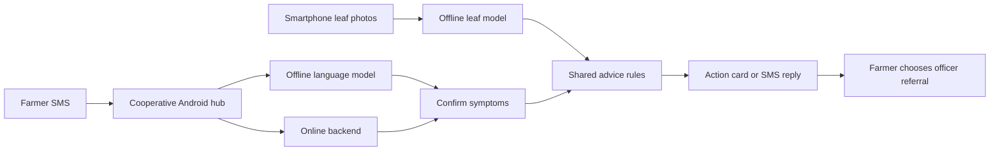

# Leaf Doctor

Leaf Doctor is our project for the **World Bank agriculture challenge** in **Small AI for Development** at Hack-Nation's 7th Global AI Hackathon, October 3–4, 2026.

We are building for smallholder coffee farmers who have limited mobile data and infrequent access to an extension officer. The challenge uses a fictional farmer, Noor; our research focuses on Kenya's coffee belt. Leaf Doctor combines offline leaf checks with SMS support so a farmer can decide what to inspect next and when to ask a person for help.

## What we are building

- **Offline leaf checks:** photograph up to six leaves on a smartphone. A bundled TensorFlow Lite model screens image quality and suggests a supported condition. Unclear photos prompt a retake; conflicting or insufficient usable readings lead to an officer referral.
- **Action cards:** shared rules turn findings into next steps and a recheck date. Farmers can read the card aloud and choose to send a case summary through their SMS app.
- **Basic-phone support:** a cooperative's Android hub receives SMS questions. It uses the backend when connected and a local language model with rule-based replies when offline. Model-assisted symptom readings require confirmation.
- **English and Swahili:** the apps and replies support both languages. Unreviewed action-card translations fall back to English; native-speaker review remains necessary before field use.

This is a research prototype. Dataset accuracy does not establish field accuracy, physical-phone performance remains unverified, and we have not measured a yield benefit. The project is a hackathon submission; it does not claim a World Bank partnership or endorsement.

## How it fits together



| Folder | Purpose |
| --- | --- |
| `mobile/` | Expo smartphone app, multi-leaf checks, local observations and case sharing |
| `hub/` | Android SMS hub with online and offline answering |
| `shared/` | Disease facts, symptom matching, plant voting, advice and SMS rules |
| `backend/` | Convex backend, Claude advisor, Twilio SMS and phone authentication |
| `training/` | Coffee-leaf training, export and evaluation evidence |
| `satellite-hotspots/` | Separate crop-anomaly research component; not a validated coffee disease detector |

## Getting started

Install Node.js and npm, then run:

```bash
git clone https://github.com/Imhaohao/global-ai-hackathon
cd global-ai-hackathon
npm ci
npm run typecheck
npm run lint
npm test
```

The smartphone app needs a native development build because it bundles TensorFlow Lite:

```bash
cd mobile
npm ci
npm run android
# Or, on macOS with Xcode installed:
npm run ios
```

Android builds require the Android SDK and a device or emulator. Online SMS and authentication require your own provider configuration; see [backend configuration](backend/.env.example) and [hub configuration](hub/.env.example).

## Project references

- [Product plan](docs/refined-plan.md) and [build plan](docs/build-plan.md) describe the intended workflow; some details predate the current implementation.
- [Research sources](docs/research-sources.md) and [development evidence](docs/evidence.md) record sources and their verification status.
- [Farmer data flow](docs/data-flow.md) explains storage, providers and deletion limits.
- [Model data card](docs/data-card.md) documents training data and evaluation limits. Model results and reproduction steps follow below.

## Local coffee-leaf model

See the [model data card](docs/data-card.md) and the [committed recovered evaluation](training/results/final-evaluation.json). That evaluation is marked `not_reproduced`; the historical metrics below are tied to the current artifact and calibration hashes.

The desktop training pipeline starts from `Huyt/arabica-coffee-leaf-disease-efficientnet-b0` at revision `252d26841543befab22880876f8ca91543230aab`. It uses PyTorch/timm on CPU and exports a bundled offline TensorFlow Lite model. The existing `training/train.py` is the separate original MobileNet experiment; use the EfficientNet scripts below for this model.

The current bundled model version is `deployed-v1` with **4,017,796 parameters**. `mobile/assets/model/coffee-leaf.tflite` is **8,091,596 bytes (7.72 MiB)**, with FP16 weight storage and float32 operations/input/output. Its SHA256 is `19b4f9747604dcff2cc43f44e3056f5c4fd827e3b0556e6632e1acbd1ce6ccda`. Desktop CPU inference measured a median of about **51 ms** with four threads; this is not a phone benchmark. The fresh-process verifier blocked outgoing sockets and observed zero attempts. Android/iOS device validation has not been performed.

### Data and training

`training/sources.json` records sources, pinned revisions, licenses, inclusion/exclusion decisions and source/class/split counts. Five training families are used: AGML Arabica, BRACOL, RoCoLe, CoffeeLeaf-CO (including its Silva derivative subset), and Makerere Beans as unsupported non-coffee examples. The preparation retains **23,552 distinct examples**, including evaluation-only material: 14,119 train, 3,921 validation, 4,571 test and 941 external. All training examples contribute to the classifier stage. The last-backbone stage rotates one crop per parent and label each epoch to reduce correlated crop dominance. This is 30 classifier epochs followed by three partial-backbone epochs; validation selected epoch two. A further 35-epoch source-balanced/distilled classifier candidate scored lower on mean per-source validation macro F1 (0.8104 versus 0.8648) and was not selected.

Exact hashes, perceptual hashes, parent images and available plant IDs form 6,174 groups. No group crosses partitions. AGML was used by the original pretrained model; those tests must not be described as entirely unseen. CoffeeLeaf empty annotations are not treated as healthy. Dataset crop counts are not counts of independent plants. The 1,120-image RGB rust collection is a previously inspected development stress test, not training data. Its NoRust class is a binary negative, not a healthy diagnosis. The separate 100-image PG26038 set contains flatbed scans of 50 paired leaves; Mycena citricolor is unsupported, not cercospora. Both external collections were audited for exact and near matches to train/validation and known pretraining-exposed groups, with no matches found.

AGML provenance includes field-origin digital-camera images from one plantation in Mutira, Kirinyaga County, Kenya. Those images are pretraining-exposed source material, not prospective Kenyan-farm validation; independent smartphone validation remains outstanding.

### Results and limits

The recovered historical report for the deployed FP16 runtime, before the brightness-v1 update below, scored **91.05% raw accuracy** across the 4,571 internal test images. Its frozen per-class confidence and image-quality rules accepted **81.49%**; **93.10%** of accepted predictions were correct. On sources new to fine-tuning, raw accuracy was **89.53%**, accepted coverage was **74.25%**, and accepted accuracy was **91.57%**; cercospora precision was **50.00%**. All 128 held-out bean images were rejected. These are dataset results, not established field accuracy.

External results remain poor: the rust development collection scored **AUROC 0.491**, rust recall **52.66%** and specificity **43.59%** at its own validation-selected binary threshold. The original model's AUROC was 0.420. All 100 untouched external scans were rejected; raw supported-class accuracy was 20%. Synthetic severe blur was rejected only 28.7% of the time, although severe darkness was always rejected in the 223-image quality check. This model is a research prototype and needs representative phone-camera validation before field reliance.

Output order is `cercospora, healthy, miner, phoma, rust, red_spider_mite, weevil_damage, unsupported`. Mite predictions are disabled because validation evidence was insufficient; the unsupported class is always rejected. Weevil means possible chewing damage, not confirmed insect identification. Scores are model scores, not probabilities of a confirmed diagnosis. The JSON beside the model supplies the final thresholds. They were chosen on deployed-runtime validation predictions, never on the final photo sample.

With a local photo, the committed artifact-only check is:

```sh
training/.venv/bin/python training/verify_offline.py --artifact-only --photo /path/to/photo.jpg
```

It checks the artifact and config hashes, the input/output signature, normalized softmax, internal operations, FP16 storage, quality gate, and blocked network calls. It does not require a training checkpoint.

Across all 4,571 test images, FP16 and Python differed on seven top labels, nine accept/reject decisions and 15 confidence states. Maximum score difference was 0.0303. The deployed runtime determines app decisions. Before inference, resize the shortest side to 256 and center-crop 224; supply float32 RGB in 0..255 with shape `[1,224,224,3]`. Normalization and calibrated softmax are inside the graph. Desktop evaluation uses bicubic resize; native phone interpolation and JPEG encoding still require device-level verification.

### Brightness feedback

The app now uses `mobile/assets/model/brightness-config.json` for exposure screening, while retaining the model weights, JPEG inference pixels, blur threshold and disease-confidence thresholds. `training/calibrate_brightness.py` derives brightness bounds from all **13,085 supported training images**, weighting sources, groups, parents and their crops equally at each level. It verifies every image hash and freezes the limits before validation. It does not use the external scans to choose thresholds.

Brightness is measured on a lossless PNG of the same 224-pixel crop, weighted by alpha so transparent backgrounds contribute nothing. Opaque photographs still include their background; this change does not locate the leaf. Mean luminance below **40.3341** prompts the user to increase light. Mean luminance above **199.9971**, together with more than **9.2554%** of pixels at grayscale 250 or higher, prompts the user to reduce harsh light or flash. Both messages appear in English and Swahili with a retake button. Brightness guidance takes precedence over blur guidance, and unclear results continue hiding disease advice.

After freezing the limits, **3,776 of 3,788** normal supported validation images passed the brightness check. All 3,788 synthetic images darkened to 10% were flagged; 3,195 of 3,788 brightened 4× were flagged. The 100 transparent scans pass the corrected brightness check, but their poor disease predictions remain unresolved. These are exposure-screening results, not updated end-to-end accuracy or phone-validation results. Earlier acceptance/precision numbers above describe the original gate and must not be attributed to this update.

Run `training/.venv/Scripts/python.exe training/calibrate_brightness.py` to reproduce the limits and evidence in `training/runs/brightness_v1/`. Run `node --experimental-transform-types training/check_mobile_contract.cjs` for class-gate, exposure, transparency, decoder, localization and mocked classifier integration checks. Native resize/color handling and the extra PNG encoding still require a physical-phone check.

### Reproduce on Windows

Python 3.12 is used. Install CPU PyTorch from its official index, then the locked environment:

```powershell
python -m venv training/.venv
training/.venv/Scripts/python.exe -m pip install torch==2.14.1+cpu torchvision==0.29.1+cpu --index-url https://download.pytorch.org/whl/cpu
training/.venv/Scripts/python.exe -m pip install -r training/requirements-efficientnet-lock.txt
training/.venv/Scripts/python.exe training/download_sources.py
training/.venv/Scripts/python.exe training/download_extra.py
training/.venv/Scripts/python.exe training/download_co.py
training/.venv/Scripts/python.exe training/download_field.py
training/.venv/Scripts/python.exe training/download_scans.py
training/.venv/Scripts/python.exe training/prepare_data.py
training/.venv/Scripts/python.exe training/finetune.py --epochs 3
training/.venv/Scripts/python.exe training/calibrate_rejection.py
training/.venv/Scripts/python.exe training/export_mobile.py --publish
training/.venv/Scripts/python.exe training/final_evaluation.py
training/.venv/Scripts/python.exe training/verify_offline.py
```

Keep seed 42, the pinned downloads and `data/manifest.json` with the run. Feature caches validate the manifest, actual image contents, preprocessing and model state. Training and candidate selection must happen before calibration/export; repeat those downstream stages whenever selecting a new checkpoint. `training/improve_generalization.py` reproduces the optional source-balanced comparison. Hardware/library changes can alter numerical results.

For a single local photo, run `training/.venv/Scripts/python.exe training/infer.py C:/path/to/leaf.jpg`. The selected checkpoint, histories and full frozen-gate evaluation live under `training/runs/efficientnet/`. `training/evaluate_photos.py --output C:/path/to/evaluation` produces a reproducible 20-image internal photo review plus separate external examples after training; it asserts that model and app artifacts stay unchanged. Large data, environments, caches and research checkpoints are ignored by Git. The deployable model remains at the application's existing tracked asset path.

### Additional data and scale experiments

The validated model and its app integration were pushed in commit `aa836a0fffdc9c58065d557923211a6d2ecbf865` after syncing the latest repository. The merged code passed 39 tests, root/mobile lint and type checks, and the mobile model contract checks. Mobile lint retains the existing bundled-asset `require()` warning. There were no unresolved merges or case/Unicode filename collisions.

The subsequent local experiments considered 29 registered sources. They admitted 1,498 Peru photos (one corrupt image excluded) and 7,364 crops from expert-reviewed BRACOL annotations. BRACOL crops are additional annotations of existing photographs, not new independent plants; all inherit their original parent groups and splits. The resulting candidate manifest has 20,311 training, 5,294 validation, 5,868 test and 941 external rows. Sampling rotates grouped examples rather than using every correlated crop in each epoch. Empty annotations are never relabelled healthy. The entire augmented Uganda source was excluded after transformed overlap was found; Xinzhai remains unused pending taxonomy and overlap checks, and its downloaded archive contains no mite class. Source details are in `training/sources.json`.

`training/train_scale.py` ran six conservative epochs with scale/context augmentation. `training/train_scale_balanced.py` then restarted from the published incumbent, ran four epochs at learning rate 0.000003, used 70% original-view replay and 30% full-target padded scale views, and sampled more distinct weak-class examples. Both froze BatchNorm statistics and most backbone weights, used weight decay, dropout, label smoothing, and validation-based selection with patience two. Correct, confident teacher outputs were a regularizer only; no source labels were replaced by model predictions. Context enlargement is confined to the padded branch in the follow-up, avoiding the center-crop loss found by the annotation coverage audit. Original canonical app crops may still trim elongated targets.

Neither run passed the replacement criteria. The follow-up's final mean per-source validation F1 on the smaller-leaf probe rose from 0.5212 to 0.6582, but original-view Cercospora F1 fell from 0.8683 to 0.8323 and mite F1 from 0.4308 to 0.4068. Healthy F1 rose from 0.8618 to 0.8929. The published app model and calibration therefore remain unchanged. These are validation results, not new test or field-accuracy claims; no test predictions were used for candidate selection. Training has stopped at the planned limits. Distance variability is not solved by these experiments.

Local histories and audits are under `training/runs/scale_v2/` and `training/runs/scale_v3/`. `training/audit_context_coverage.py` traces all context views to their original annotation index, category, box and preprocessing coverage. `training/prepare_expert_data.py` creates the reviewed-crop manifest without changing earlier splits. `training/report_scale_experiments.py --output C:/path/to/report` exports the comparison and source/label audits.

### Choosing between EfficientNet-B0 and EfficientNet-B1

The capture screen offers B0 (the default original model) and B1 (experimental). Only the selected model is loaded, selection is disabled while a photo is being processed, and results identify the model used. Loading failures offer retry or switching models. Both use the same brightness feedback and input crop, with separate validation-calibrated disease-confidence thresholds. Both assets are bundled for offline use.

B1 starts from Apache-2.0 ImageNet weights `timm/efficientnet_b1.ft_in1k` at revision `1d6ddfd0ad535646fdb05bc3834913d93816152e`. It has 6,523,432 parameters and uses 224-pixel input, consistent with that checkpoint's training resolution and the existing app contract. Its classifier sees all **20,311 vetted training images**, including Peru and reviewed BRACOL crops. The same 5,294 validation images guide selection. Evaluation-only sources and unresolved datasets remain excluded. This compares the delivered models: B0 has coffee-specific pretraining and the original corpus, while B1 has ImageNet pretraining and the expanded corpus. The results cannot isolate the effect of architecture alone.

B1 uses seed 20261003. Its regularized classifier stage stopped after 21 epochs and retained epoch 16; the partial-backbone stage completed its six-epoch maximum and selected epoch six. Most weights and BatchNorm statistics stay frozen. Grouped parent rotation, mild color jitter, full-target padding, dropout, weight decay and label smoothing limit overfitting. Selection combines ordinary, smaller-leaf and full-context validation scores; Cercospora, healthy and mite F1 may not fall more than one percentage point below B1's classifier-stage baseline. Held-out and external images never select checkpoints or thresholds. These controls reduce overfitting risk but cannot establish real-world generalization. All 25,605 current train/validation image hashes matched the manifest, and fresh predictions on 96 class-balanced validation images exactly matched the saved selected-checkpoint logits.

After preparing the existing `scale_v3_manifest.json`, reproduce the B1 workflow with the locked Python environment:

```powershell
training/.venv/Scripts/python.exe training/b1_train.py
training/.venv/Scripts/python.exe training/b1_verify.py
training/.venv/Scripts/python.exe training/export_b1.py
training/.venv/Scripts/python.exe training/verify_b1_offline.py
training/.venv/Scripts/python.exe training/compare_models.py --output-dir C:/path/to/comparison
```

Training overwrites the B1 research run; archive any research results you need before rerunning it. Export publishes only `coffee-leaf-b1.tflite` and `model-config-b1.json`. B0's model and calibration stay unchanged. The B1 export uses per-channel INT8 convolution-weight storage with float32 computation; this is a size optimization, not a claim of integer inference or faster execution. Full validation must retain accuracy and macro F1 within one percentage point of the chosen checkpoint before publication. The comparison evaluates both actual app exports on identical test images, checks checkpoint/runtime parity, applies the shared current brightness rules, and measures fresh desktop CPU latency. Physical-phone performance, native preprocessing and field accuracy still require device validation.

#### Completed B0/B1 comparison

The frozen app exports were evaluated on the same 5,868 test images. The table uses the current shared brightness policy and each model's own frozen validation confidence thresholds. The original 4,571-image subset is also retained for continuity with the earlier report.

| Metric | B0 | B1 |
| --- | ---: | ---: |
| Original test accuracy (4,571 images) | 91.05% | 93.96% |
| Expanded test accuracy (5,868 images) | 86.79% | 93.27% |
| Expanded test macro F1 | 0.7614 | 0.8640 |
| Accuracy among accepted expanded-test predictions | 88.09% | 94.16% |
| Expanded-test acceptance coverage | 80.11% | 79.38% |
| Unsupported expanded-test images falsely accepted | 38 / 202 | 0 / 202 |
| Synthetic smaller-leaf macro F1 (1,495 images) | 0.5682 | 0.7721 |
| External rust AUROC (1,119 images) | 0.4917 | 0.7421 |
| External rust recall at frozen binary cutoff | 52.66% | 15.82% |
| External rust specificity at frozen binary cutoff | 43.75% | 99.63% |
| Supported external scan accuracy (60 images) | 20.00% | 31.67% |
| Accuracy among accepted scans | 9 / 55 (16.36%) | 19 / 55 (34.55%) |
| Bundled model size (decimal MB) | 8.09 | 7.32 |
| Fresh matched desktop CPU median | 87.1 ms | 121.2 ms |

B1 is the stronger overall research candidate. Its expanded-test accuracy gain is 6.48 percentage points, with a paired recorded-group bootstrap 95% interval of +4.27 to +8.95 points. The gain on the original test is 2.91 points (+1.56 to +4.30). Groups are parent/capture proxies, not guaranteed independent plants. All eight classes improved on the expanded test, including Cercospora F1 from 0.6773 to 0.7867, healthy from 0.7329 to 0.9547, and mites from 0.3191 to 0.4828. B0 retains an advantage on original-test Phoma F1 (0.8947 versus 0.8392). Mite diagnoses remain disabled in both apps because neither passes the validation precision/evidence requirement.

External imaging is still unreliable. B1 ranks external rust better, but its validation-selected binary cutoff of 0.16 detects only 134 of 847 rust images. The actual multiclass app accepts just 22 of those 847 images as rust; AUROC is not diagnosis accuracy. Its 55 accepted scans contain only 19 correct diagnoses and 13 unsupported false accepts. Neither model is ready for field reliance. These previously inspected external collections were not used to select checkpoints, compression or thresholds. The expanded-source overlap audit conservatively removes one possible rust near-match, leaving 1,119 images; the original 100 scans remain. Synthetic smaller-leaf improvements do not establish accuracy on genuine distant phone photographs.

The B1 app asset is 7,324,120 bytes with SHA256 `28c5d1cf1ac3f268d66f9c9f50f35e0a4602dced07f55e07b17f4c6cdae18c75`. Its uncompressed conversion matched the checkpoint on 64 class-balanced validation images with no top-label changes and maximum probability error 0.00000668. Compression changed 30 of 5,294 validation top labels, with +0.094 percentage points accuracy and -0.021 points macro F1. Across all 5,868 held-out images, B1 checkpoint/app outputs differ on 45 top labels, 37 acceptance decisions and 77 confidence states; maximum probability difference is 0.2485. The table therefore uses the actual app export, not checkpoint results. B0 parity on the same expanded test is 10 top-label, 11 acceptance and 21 confidence-state differences.

Both model identities, configurations and the brightness policy stayed unchanged throughout evaluation. Fresh-process B1 inference passed with Python outbound socket calls blocked and zero attempted connections; this is not an operating-system firewall or physical-phone test. The fresh latency benchmark alternates the models over the same 64 images for 128 timed invocations each with four CPU threads, excludes image decoding/preprocessing, and runs after training and other inference jobs finish. Full evidence, class/source breakdowns, confusion matrices, manifest audits and paired intervals are in `training/runs/model_comparison/comparison.json`. App TypeScript, lint, six model-selection tests, the 39-test shared/backend suite, brightness contracts and the Android JavaScript/asset export passed. The Android export contains both model files; no native phone build was tested.

### EfficientNet-B2 experiment

B2 follows the B1 training functions in an isolated module namespace. It uses the same 20,311 training images, 5,294 validation images, seed 20261003, grouped sampling, augmentation, optimizer settings, stopping limits and validation selection safeguards. Neither existing model is retrained or replaced. The third app choice has its own model and confidence configuration, uses the shared brightness feedback, and retains B0 as the default.

The initialization is the Apache-2.0 `timm/efficientnet_b2.ra_in1k` checkpoint at revision `3577c4a7d84723645311bb5a9e5086f1b62ec8e2`, with weights SHA256 `e9adbcce7e5d5055c571c4cafdcc7f920b6a6ec42e643c49dff1aabe1d5f53c5`. The eight-class model has **7,712,266 parameters**. Its native pretraining resolution is 256 pixels and its published test setting is 288 pixels. This experiment fine-tunes and evaluates it at the common **224-pixel app resolution**. B1 and B2 therefore share the fine-tuning recipe and data, while their pretrained initialization and pretraining recipes differ. This comparison does not measure B2 at its published 288-pixel setting or isolate architecture alone.

Use the existing locked Python environment and prepared `scale_v3_manifest.json`:

```powershell
training/.venv/Scripts/python.exe training/b2_train.py
training/.venv/Scripts/python.exe training/b2_verify.py
training/.venv/Scripts/python.exe training/export_b2.py
training/.venv/Scripts/python.exe training/verify_b2_offline.py
training/.venv/Scripts/python.exe training/compare_models_b2.py --output-dir C:/path/to/comparison-b2
```

The B2 run identity checks the training engine, wrapper, dataset code, pinned initial weights, manifest, seed and input size before resuming. Export uses the same validation-only compression limits and calibration policy as B1, writes only `coffee-leaf-b2.tflite` and `model-config-b2.json`, and verifies incumbent identities. Reports are stored separately under `training/runs/efficientnet_b2/` and `training/runs/model_comparison_b2/`. The three-model evaluation reuses B0/B1 predictions only when strict cache signatures still match; it preserves their previous reports and measures new CPU timings with all six model orders balanced. No test or external image selects the B2 checkpoint, export variant or confidence thresholds.

B2 training completed with classifier epoch 21 selected after early stopping at 26 epochs, followed by the selected backbone epoch 6 at the six-epoch limit. The checkpoint's selection-set validation accuracy is 93.33% and macro F1 is 0.8660; these are not held-out test results. All 25,605 training/validation image hashes matched the manifest, and fresh logits on 96 validation images exactly matched the selected checkpoint's saved predictions. The checkpoint SHA256 is `eb6a5d4daac75046befce1250bc9278d4c1d2ccfa8ccf0fe2f4302cb918e8dd8`.

The B2 app asset is 8,573,416 bytes with SHA256 `ddbea87650b839dabb376f32d7e210ccc21a105024de23b3c0abf25fbbe86a01`. Uncompressed conversion matched the checkpoint on 64 validation samples with no top-label changes and maximum probability error 0.00000244. The selected INT8 weight-storage export changed 50 of 5,294 validation top labels, reducing accuracy by 0.264 percentage points and macro F1 by 0.223 points, within the unchanged one-point limits. Maximum per-probability error was 0.5101, so later comparisons must evaluate the actual exported model rather than substitute checkpoint scores. Confidence thresholds were fitted using that export's validation predictions; mite diagnoses remain disabled because the precision/evidence requirement was not met. Fresh-process inference passed with Python outbound socket calls blocked and zero attempted connections. Physical-phone behavior remains untested.

The app now offers B0, B1 and experimental B2, with B0 still selected by default. TypeScript, full mobile lint, all six model-selection tests, the brightness/model contracts and the Android JavaScript/asset bundle passed. The bundle contains all three model assets; it is not a physical-device build or test.

The final held-out evaluation now includes B0, B1, B2 and the separately verified B3 candidate. B3 remains outside the app because its exported file exceeds the unchanged 10 MB limit.

The separate four-model runner requires a completed, verified B3 directory and preserves earlier reports:

```powershell
training/.venv/Scripts/python.exe training/compare_models_b3.py --b3-dir training/candidates/efficientnet-b3 --check-ready
training/.venv/Scripts/python.exe training/compare_models_b3.py --b3-dir training/candidates/efficientnet-b3 --output-dir C:/path/to/model-comparison-all-four
```

It uses the same matched test partitions and external collections, evaluates actual exported models, reports every pair's recorded-group accuracy interval, and measures fresh CPU timings with model order balanced. An exported B3 candidate over the unchanged 10 MB app limit can be compared, but its deployment ineligibility is reported explicitly; comparison does not install it in the app.

The pairwise 95% bootstrap intervals are descriptive and unadjusted across six pairs and multiple subsets. They cover accuracy differences, not macro F1, AUROC or acceptance metrics. The expanded test's 5,868 images represent 982 recorded capture/parent groups; these proxies do not measure uncertainty across new farms, new imaging conditions or training seeds. Mites have only 26 test images in 18 groups from one source, and the 894 weevil crops represent 63 groups from one source. Per-class and source-specific results matter alongside overall accuracy. External collections have been inspected previously and remain stress tests, not fresh confirmatory field validation.

#### Completed four-model comparison

All four frozen exports were evaluated on the same images with the same current brightness/blur policy and their own validation-selected confidence thresholds. B3's gate results simulate the app policy offline; they do not imply installation. The full report, confusion matrices, per-source/class results, checkpoint/export parity and all six pairwise intervals are in `training/reports/model_comparison_b3/comparison.json`.

| Metric | B0 | B1 | B2 | B3 candidate |
| --- | ---: | ---: | ---: | ---: |
| Expanded test accuracy (5,868 images) | 86.79% | 93.27% | 94.09% | 93.22% |
| Original test accuracy (4,571 images) | 91.05% | 93.96% | 94.47% | 93.74% |
| Expanded macro F1 | 0.7614 | 0.8640 | 0.8720 | 0.8544 |
| Accuracy among accepted test predictions | 88.09% | 94.16% | 95.14% | 94.14% |
| Test acceptance coverage | 80.11% | 79.38% | 79.52% | 79.11% |
| Unsupported test images falsely accepted | 38 / 202 | 0 / 202 | 0 / 202 | 0 / 202 |
| Synthetic smaller-leaf macro F1 (1,495 images) | 0.5682 | 0.7721 | 0.8440 | 0.8083 |
| External rust AUROC (1,119 images) | 0.4917 | 0.7421 | 0.7780 | 0.6973 |
| External rust recall at frozen binary cutoff | 52.66% | 15.82% | 4.72% | 23.26% |
| External rust specificity at frozen binary cutoff | 43.75% | 99.63% | 100.00% | 98.90% |
| Correct accepted rust diagnoses on 847 external positives | 143 | 22 | 16 | 52 |
| Falsely accepted rust diagnoses on 272 binary negatives | 74 | 0 | 0 | 0 |
| Correct predictions among accepted external scans | 9 / 55 | 19 / 55 | 10 / 89 | 28 / 63 |
| Unsupported external scans falsely accepted | 16 / 40 | 13 / 40 | 34 / 40 | 13 / 40 |
| Supported external scan raw accuracy (60 images) | 20.00% | 31.67% | 18.33% | 56.67% |
| Export size (decimal MB) | 8.09 | 7.32 | 8.57 | 11.80 |
| Parameters (millions) | 4.02 | 6.52 | 7.71 | 10.71 |

B2 has the highest measured aggregate test accuracy, macro F1 and synthetic smaller-leaf macro F1. Its accuracy advantage over B1 is 0.82 percentage points, but the descriptive paired 95% interval is -0.02 to +1.64 points, so this run does not establish a clear accuracy separation. B2 improves Phoma F1 from B1's 0.8319 to 0.8906 and mites from 0.4828 to 0.5397, while Cercospora falls from 0.7867 to 0.7167. B3's accuracy is effectively tied with B1 on this test (-0.05 points; interval -0.87 to +0.80), and its macro F1 is lower. B3 trails B2 by 0.87 points (interval -1.69 to -0.11). These intervals are unadjusted and do not identify a universal winner across classes, sources and deployment conditions. Mite diagnoses remain disabled in every model's confidence policy.

External imaging remains inadequate for field reliance. B2's higher rust AUROC does not translate into useful recall at its frozen threshold, and its 89 accepted scans contain only 10 correct predictions and 34 unsupported false accepts. B3 performs best on these scans, but only 28 of its 63 accepted predictions are correct, and it correctly accepts just 52 of 847 external rust positives under the app policy. B1 retains advantages over B2 on Cercospora, several source-specific results and scan rejection. B2 is useful for continued internal/scale experiments; B3's measured tradeoffs and size failure do not support replacing an app model. None of these results resolves the external-imaging requirement.

B3 has 10,708,528 parameters; its 11,796,544-byte export SHA256 is `5ab0a8f6292b67440d4c53e51b6b8155a5c474c403428f7a70974d599997deb4`. Its selected checkpoint SHA256 is `a808dffa181630d47acc74788dcf38f95d0618b1e51b0dcd7f0990071d55c433`. It uses the same fine-tuning data and rules but a different ImageNet initialization, with native 288/320-pixel training/test settings reduced to the shared 224-pixel experiment. The historical B2 wrapper change detected by B3's broad file guard is preserved in the report: only the exact independently reconstructed completed-run guard/history additions are allowed; training, preprocessing and selection engines remained unchanged. Frozen artifacts and prior reports were verified unchanged throughout both evaluation and timing.

#### Repeated single-image response times

These are fresh measurements after all training and parallel evaluation workers exited. The main comparison measured 256 loaded-model invocations per model over the same 64 images, balancing four model orders. A separate response test used eight fixed images (one per class), 12 repeats per image, or **96 timed single-image responses per model**. Its inference and total-response columns below come from the same trials. All measurements use four CPU threads on this desktop.

| Timing metric | B0 | B1 | B2 | B3 candidate |
| --- | ---: | ---: | ---: | ---: |
| Main comparison mean invocation (256 trials) | 56.8 ms | 83.9 ms | 90.6 ms | 117.4 ms |
| Single-image mean inference (96 trials) | 57.6 ms | 86.1 ms | 92.9 ms | 120.1 ms |
| Single-image mean response including preparation | 62.7 ms | 91.3 ms | 98.1 ms | 125.2 ms |
| Single-image median response | 59.8 ms | 89.2 ms | 95.1 ms | 122.9 ms |
| Single-image 90th-percentile response | 72.9 ms | 104.6 ms | 110.1 ms | 140.5 ms |

Total response includes fresh local image opening/decoding, resizing/cropping, the shared quality checks (including a second image decode for exposure), tensor transfer, model invocation, output retrieval and the confidence/quality decision. It excludes model loading, initialization, camera capture, mobile bridge work and UI rendering. Models and the operating-system file cache were warm. The eight inputs are dataset crops ranging from 37×32 to 910×272 pixels; the results do not establish full-resolution phone-photo or native Expo response time. Per-image dimensions, all raw trials, means, medians, tails, source identities and checks are saved in `training/reports/model_comparison_b3/single_image_timing.json`.

```powershell
training/.venv/Scripts/python.exe training/benchmark_single_image.py --b3-dir training/candidates/efficientnet-b3 --output-dir C:/path/to/model-comparison-all-four
```

Run this only after the four-model comparison completes and other CPU workloads finish. The timing script requires the matching completed report and verifies frozen inputs and source code before and after measurement.


#### Packaged models and evaluation evidence

B0, B1 and B2 exports and configurations are in `mobile/assets/model/`. The B3 export, selected checkpoint, configuration, original training scripts and verification evidence are in `training/candidates/efficientnet-b3/`. B3 remains an offline comparison candidate above the 10 MB per-model app limit. The app retains B0 as its default and allows B1/B2 selection in the multi-leaf workflow; switching clears the current check, and saved checks record the selected calibration/artifact version.

The selected B0/B1/B2 checkpoints and their available verification reports are in `training/checkpoints/`. The completed four-model comparison and timing reports are frozen in `training/reports/model_comparison_b3/`. These reports retain their original machine paths as historical evidence. The B3 training scripts also retain their original paths because their exact bytes are pinned by the run identity; the portable comparison runner loads B3 directly from `--b3-dir` without executing those historical training entry points.

The original split manifests are in `training/manifests/`; image datasets, pretrained base weights, local environments, prediction caches and intermediate optimizer states are not committed. To repeat evaluation, restore the authorized images at the paths recorded in the manifests, copy the manifests into `training/data/`, copy each selected checkpoint directory from `training/checkpoints/` into `training/runs/`, and copy the pinned metadata from `training/pretrained/` into `training/models/`. Keep the original manifests and frozen evidence unchanged. The comparison writes fresh reports into `training/runs/model_comparison_b3/`; the checked-in reports stay separate. Timing requires a completed fresh comparison in that runtime directory.

The independent [satellite project](satellite-hotspots/README.md) includes its source, tests, synthetic demos, trained checkpoints, provenance and license notices. Its prepared Agriculture-Vision dataset and local monitoring databases remain outside Git. Run its tests from `satellite-hotspots/` so its separate `training` package does not collide with the leaf training scripts.
